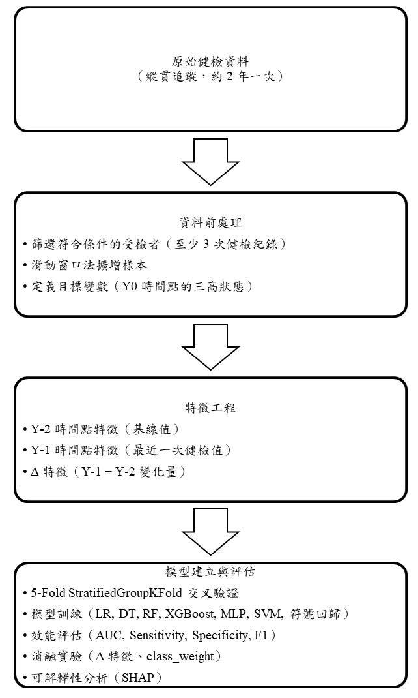
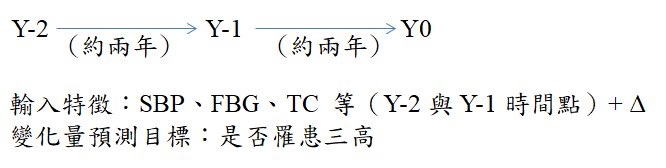
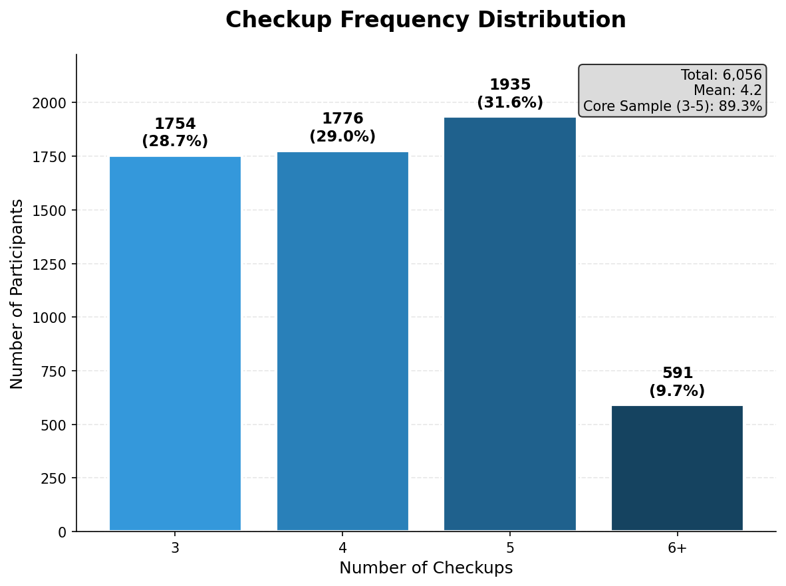

# 第五章 研究設計

本章說明本研究之整體研究設計，包含研究架構、資料來源與處理、特徵工程、模型評估指標、實驗設計，以及實驗環境。模型方法之詳細說明請參閱第四章。

## 5.1 研究架構

本研究旨在建立一個基於縱貫性健康檢查資料的三高（高血壓、高血糖、高血脂）風險預測模型。研究架構如圖 5-1 所示，整體流程分為四個階段：資料前處理、特徵工程、模型建立與評估。

**圖 5-1 研究架構圖**

### 5.1.1 研究時間軸設計

本研究採用三個時間點的縱貫設計，如圖 5-2 所示。時間點命名採用相對於預測目標年（Y0）的方式：Y-2 為四年前、Y-1 為兩年前、Y0 為預測目標年。

**圖 5-2 研究時間軸設計**

模型的輸入特徵包含 Y-2 與 Y-1 兩個時間點的健檢指標（SBP、DBP、FBG、TC 等），以及兩時間點之間的變化量（Δ 特徵）。預測目標為 Y0 時間點是否罹患三高（高血壓、高血糖、高血脂）。

選擇 Y0 而非 Y-1 作為預測目標的原因：

1. **避免資料洩漏**：若以 Y-1 為目標，Y-1 的健檢數據與疾病狀態來自同一次檢查，會造成模型「偷看答案」
2. **Δ 特徵可用**：以 Y0 為目標，才能將 Y-1 與 Y-2 的變化量作為有效的預測因子
3. **臨床意義**：提供約 2 年的預警時間窗口，讓醫療人員有足夠時間進行早期介入

## 5.2 資料來源與處理

### 5.2.1 資料來源

本研究使用公開於 Dryad 數位資料庫的縱貫性健康檢查資料集（Luo et al., 2024）。

該資料集來自中國浙江省杭州市的社區健康調查，收集期間為 2010 至 2018 年，納入 40 歲以上成人共 6,119 人，多數參與者進行了 3 次以上的健康檢查。

資料特點為僅記錄「第幾次健檢」而無具體日期，追蹤間隔以年齡差推算（例如：55 歲 → 57 歲 = 2 年間隔）。經分析，約 90% 的受檢者維持固定 **2 年間隔**，9.6% 為 1 年間隔（可能為提前回診），平均追蹤間隔為 1.90 年（標準差 0.36 年）。因此，本研究的時間點命名為 Y-2（四年前）、Y-1（兩年前）、Y0（預測目標），反映實際的健檢間隔。由於間隔高度一致，Δ 特徵可直接比較，無需額外的時間校正。

### 5.2.2 樣本篩選

原始資料集包含 6,119 位參與者共 25,744 筆健檢記錄。由於本研究採用三時間點縱貫設計（Y-2、Y-1、Y0），需要每位參與者至少有 3 次健檢紀錄才能建構完整的特徵集與預測目標。

**納入條件**：
- 至少有 3 次以上的連續健檢紀錄
- 各時間點資料完整，無重大缺失

**排除情況**：
- 共 63 人因僅有 1-2 次健檢紀錄而被排除
- 資料保留率達 98.97%

**最終樣本數**：6,056 人

篩選後樣本之健檢次數分佈如圖 5-3 所示。約 90% 的樣本健檢次數介於 3 至 5 次之間，其中以 5 次健檢者最多（31.95%），其次為 4 次（29.33%）及 3 次（28.96%）。少數樣本有 6 次以上的健檢紀錄（合計 9.76%）。

**圖 5-3 樣本健檢次數分佈（n = 6,056）**

### 5.2.3 滑動窗口法

為充分利用多次健檢資料，本研究採用滑動窗口（Sliding Window）方法擴增訓練樣本。對於有 N 次健檢紀錄的參與者，可產生 (N-2) 個訓練樣本：

- 3 次健檢 → 1 個樣本：(Y-2, Y-1, Y0)
- 4 次健檢 → 2 個樣本：(Y-3, Y-2, Y-1)、(Y-2, Y-1, Y0)
- 5 次健檢 → 3 個樣本：(Y-4, Y-3, Y-2)、(Y-3, Y-2, Y-1)、(Y-2, Y-1, Y0)

經滑動窗口處理後，6,056 位參與者共產生 **13,514 筆建模紀錄**。此方法的優點：

1. **充分利用資料**：多次健檢者貢獻更多樣本
2. **捕捉不同階段**：同一人在不同年齡階段的健康變化皆納入分析

需注意的是，由於同一參與者可能產生多筆紀錄，在交叉驗證時必須確保同一人的所有紀錄不會同時出現在訓練集與測試集中（詳見 5.4.1 節）。

### 5.2.4 變數定義

本資料集包含人口學變數、健檢指標及目標變數三類，各變數說明如表 5-1 所示。

**表 5-1 研究變數定義**

| 變數類別 | 變數名稱 | 說明 | 單位/編碼 |
|----------|----------|------|-----------|
| 人口學 | Sex | 性別 | 1=男, 2=女 |
|  | Age | 年齡 | 歲 |
| 健檢指標 | BMI | 身體質量指數 | kg/m² |
|  | SBP | 收縮壓 | mmHg |
|  | DBP | 舒張壓 | mmHg |
|  | FBG | 空腹血糖 | mmol/L |
|  | TC | 總膽固醇 | mmol/L |
|  | Cr | 肌酐 | μmol/L |
|  | eGFR | 腎絲球過濾率 | mL/min/1.73m² |
|  | UA | 尿酸 | μmol/L |

本研究之目標變數為三高疾病狀態（高血壓、高血糖、高血脂），由資料集中的確診欄位直接取得。原始資料中，三項目標變數皆以 1 = 正常、2 = 患病 進行編碼，本研究於建模前將其轉換為 0 = 正常、1 = 患病 之二元格式。

### 5.2.5 類別不平衡情況

三高疾病在本資料集中呈現不同程度的類別不平衡。在 6,056 位樣本中，高血壓患者共 1,010 人（16.68%），負正類比例約為 5:1，屬於輕度不平衡；高血糖患者共 335 人（5.53%），負正類比例約為 17:1；高血脂患者共 361 人（5.96%），負正類比例約為 16:1，兩者皆屬於重度不平衡。

此類別不平衡現象反映了真實世界中三高疾病的盛行率特性，但可能導致模型偏向預測多數類（健康），進而降低對少數類（患病）的識別能力。因此，本研究將於模型訓練階段採用 class_weight 方法進行調整，詳見第四章 4.4 節。

## 5.3 特徵工程

### 5.3.1 特徵集設計

本研究使用的特徵分為四類，共 26 個特徵，如表 5-2 所示。

**表 5-2 特徵集設計**

| 特徵類別 | 包含特徵 | 特徵數 |
|----------|----------|--------|
| 基本資訊 | Sex, Age | 2 |
| Y-2 時間點特徵 | FBG_Y-2, TC_Y-2, Cr_Y-2, UA_Y-2, eGFR_Y-2, BMI_Y-2, SBP_Y-2, DBP_Y-2 | 8 |
| Y-1 時間點特徵 | FBG_Y-1, TC_Y-1, Cr_Y-1, UA_Y-1, eGFR_Y-1, BMI_Y-1, SBP_Y-1, DBP_Y-1 | 8 |
| Δ 特徵（Y-1 − Y-2） | ΔFBG, ΔTC, ΔCr, ΔUA, ΔeGFR, ΔBMI, ΔSBP, ΔDBP | 8 |
| 合計 | — | 26 |

### 5.3.2 Δ 特徵的意義

Δ 特徵代表 Y-1 與 Y-2 之間的變化量：

$$\Delta_i = X_{i,Y-1} - X_{i,Y-2} \tag{5-1}$$

Δ 特徵的設計理念：

- **捕捉動態趨勢**：某些疾病的發展不僅取決於當前數值，更取決於變化趨勢
- **正值代表上升**：例如 ΔFBG > 0 表示血糖在兩年間上升
- **負值代表下降**：例如 ΔeGFR < 0 表示腎功能在兩年間下降

## 5.4 模型評估

### 5.4.1 交叉驗證策略

本研究採用 scikit-learn 提供的 **StratifiedGroupKFold** 進行 5-Fold 交叉驗證。此方法結合了分層抽樣（Stratified）與群組控制（Group）兩項特性：

1. **分層抽樣**：確保每個 fold 中各類別（患病/健康）的比例與整體資料集一致
2. **群組控制**：確保同一參與者的所有紀錄（由滑動窗口產生）不會同時出現在訓練集與測試集中

此設計的重要性在於：由於滑動窗口法使同一參與者可能貢獻多筆紀錄，若不進行群組控制，模型可能在訓練時學習到某位參與者的特徵模式，而在測試時遇到同一人的其他紀錄，造成評估結果過度樂觀（資料洩漏）。

**交叉驗證資料規模**

| 項目 | 數量 |
|------|------|
| 參與者數 | 6,056 人 |
| 建模紀錄數（滑動窗口後） | 13,514 筆 |
| Fold 數 | 5 |
| 每 Fold 約測試紀錄數 | ~2,703 筆 |

### 5.4.2 評估指標

#### AUC-ROC (Area Under the ROC Curve)

ROC 曲線以 False Positive Rate 為 X 軸，True Positive Rate 為 Y 軸，AUC 為曲線下面積。

- AUC = 0.5：隨機猜測
- AUC = 0.7-0.8：可接受
- AUC = 0.8-0.9：良好
- AUC > 0.9：優秀

**特點**：與分類閾值無關，反映模型的整體排序能力。

#### Sensitivity（敏感度/召回率）

$$Sensitivity = \frac{TP}{TP + FN} \tag{5-2}$$

代表模型正確識別患病者的能力。在疾病篩檢中，高 Sensitivity 意味著較少漏診。

#### Specificity（特異度）

$$Specificity = \frac{TN}{TN + FP} \tag{5-3}$$

代表模型正確排除健康者的能力。高 Specificity 意味著較少誤診。

#### F1-Score

$$F1 = 2 \times \frac{Precision \times Recall}{Precision + Recall} \tag{5-4}$$

精確率與召回率的調和平均，適用於類別不平衡的情況。

#### 混淆矩陣

混淆矩陣（Confusion Matrix）為評估分類模型效能的基礎工具，用於呈現模型預測結果與實際類別之間的對應關係。在二元分類問題中，混淆矩陣包含四個元素：

- **True Positive（TP，真陽性）**：實際為患病且模型正確預測為患病的樣本數
- **True Negative（TN，真陰性）**：實際為健康且模型正確預測為健康的樣本數
- **False Positive（FP，偽陽性）**：實際為健康但模型錯誤預測為患病的樣本數
- **False Negative（FN，偽陰性）**：實際為患病但模型錯誤預測為健康的樣本數

上述 Sensitivity、Specificity 及 F1-Score 皆由混淆矩陣計算而得。在健康篩檢應用中，漏診比誤診後果更嚴重，故本研究特別重視 Sensitivity。

#### 未採用 PR-AUC 之說明

在極度類別不平衡（正樣本比例 < 5%）的情境下，ROC-AUC 可能因大量真陰性而產生過度樂觀的評估，此時 Precision-Recall AUC（PR-AUC）被認為是更適合的指標（Saito & Rehmsmeier, 2015）。然而，本資料集三項疾病的盛行率分別為高血壓 16.68%、高血糖 5.53%、高血脂 5.96%，皆高於 5% 的極度不平衡門檻，且本研究已搭配 class_weight 調整與 Sensitivity/Specificity 報告，足以反映模型在少數類上的辨識能力，故本研究以 AUC-ROC 作為主要評估指標。

## 5.5 實驗設計

本研究設計一系列消融實驗（Ablation Study）與比較實驗，以驗證研究問題。實驗設計總覽如表 5-3 所示。

**表 5-3 實驗設計總覽**

| 實驗 | 目的 |
|------|------|
| Δ 特徵消融 | 驗證變化量特徵的貢獻 |
| 模型比較 | 比較簡單與複雜模型效能 |
| 特徵選擇消融 | 驗證精簡特徵集的可行性 |
| 類別不平衡處理比較 | 比較不同不平衡處理方法 |
| 符號回歸實驗 | 探索可解釋數學公式 |

### 5.5.1 消融實驗

#### Δ 特徵消融實驗

為驗證 Δ 特徵對預測效能的貢獻，本研究設計五組特徵組合進行消融實驗，如表 5-4 所示。

**表 5-4 Δ 特徵消融實驗設計**

| 實驗組 | 特徵組合 | 特徵數 | 說明 |
|--------|----------|--------|------|
| Full | Y-2 + Y-1 + Δ | 26 | 完整特徵集 |
| No-Δ | Y-2 + Y-1 | 18 | 移除 Δ 特徵 |
| Y-2-Only | Y-2 | 10 | 僅使用基線值 |
| Y-1-Only | Y-1 | 10 | 僅使用最近值 |
| Δ-Only | Δ | 10 | 僅使用變化量 |

#### 特徵選擇消融實驗

為驗證精簡特徵集的可行性，本研究基於 SHAP 特徵重要性排序，設計不同特徵數量的消融實驗，如表 5-5 所示。

**表 5-5 特徵選擇消融實驗設計**

| 實驗組 | 特徵數 | 說明 |
|--------|--------|------|
| Top 3 | 3 | 僅使用最重要的 3 個特徵 |
| Top 5 | 5 | 僅使用最重要的 5 個特徵 |
| Top 10 | 10 | 使用前 10 個重要特徵 |
| All | 26 | 使用全部特徵（基準線） |

各疾病的 Top 5 特徵由 SHAP 分析結果決定，詳見第六章。

### 5.5.2 類別不平衡處理比較

由於三高疾病的患病率較低（5-17%），模型容易偏向預測多數類（健康），導致 Sensitivity 偏低。本研究比較五種類別不平衡處理方法，如表 5-6 所示。

**表 5-6 類別不平衡處理方法比較**

| 方法 | 類型 | 原理 | 特點 |
|------|------|------|------|
| Baseline | 無處理 | 使用原始資料分佈 | 作為對照基準 |
| class_weight | 權重調整 | 增加少數類在損失函數中的權重 | 不改變資料分佈 |
| SMOTE | 過採樣 | 在特徵空間中合成新的少數類樣本 | 增加訓練樣本數 |
| ADASYN | 自適應過採樣 | 針對難分類的少數類樣本生成更多合成樣本 | 關注邊界樣本 |
| RandomUnderSampler | 欠採樣 | 隨機移除多數類樣本 | 可能損失資訊 |

**class_weight 權重計算**：

$$w_i = \frac{n_{samples}}{n_{classes} \times n_{samples_i}} \tag{5-5}$$

其中 $w_i$ 為第 $i$ 類的權重，$n_{samples}$ 為總樣本數，$n_{classes}$ 為類別數，$n_{samples_i}$ 為第 $i$ 類的樣本數。

**SMOTE 演算法原理**：

1. 對每個少數類樣本，找出其 k 個最近鄰（預設 k=5）
2. 隨機選擇一個最近鄰
3. 在原樣本與選定鄰居之間的連線上隨機生成新樣本
4. 重複直到少數類與多數類樣本數平衡

### 5.5.3 符號回歸實驗

符號回歸旨在從資料中自動發現可解釋的數學公式。本研究使用 PySR 套件進行符號回歸實驗，實驗設計如表 5-7 所示。

**表 5-7 符號回歸實驗設計**

| 參數 | 設定 | 說明 |
|------|------|------|
| 套件 | PySR | 基於 Julia 的符號回歸套件 |
| 二元運算子 | +, -, *, / | 基本四則運算 |
| 一元運算子 | exp, log, abs, square | 數學轉換函數 |
| 最大複雜度 (maxsize) | 35 | 控制公式長度上限 |
| 迭代次數 (niterations) | 200 | 遺傳演算法迭代次數 |
| 複雜度懲罰 (parsimony) | 0.0001 | 避免過於簡單的常數解 |
| 族群數 (populations) | 20 | 平行搜索的族群數量 |
| 族群大小 (population_size) | 100 | 每個族群的個體數 |

**實驗流程**：

1. 使用 5-Fold StratifiedGroupKFold 交叉驗證（按 patient_id 分組）
2. 對訓練集進行標準化（StandardScaler）
3. 在每個 fold 的訓練集上執行 PySR
4. 從 Pareto 前沿選擇最佳公式（平衡複雜度與準確度）
5. 將預測值限制在 [0, 1] 區間作為機率估計
6. 使用訓練集正樣本比例作為分類閾值
7. 在測試集上評估公式的 AUC

**公式評估標準**：

- **預測效能**：AUC 與 Logistic Regression 相近（差距 < 5%）
- **穩定性**：多個 fold 產出類似的公式結構
- **可解釋性**：公式符合臨床直覺（如：SBP ↑ → 高血壓風險 ↑）

### 5.5.4 可解釋性分析

本研究使用 SHAP (SHapley Additive exPlanations) 進行模型可解釋性分析：

- **SHAP 值**：量化每個特徵對預測結果的貢獻
- **特徵重要性排序**：識別最具影響力的風險因子
- **交互效應**：分析特徵間的協同或拮抗作用

## 5.6 實驗環境

本研究之實驗環境與使用套件如表 5-8 所示。

**表 5-8 實驗環境與工具**

| 類別 | 項目 | 規格/版本 |
|------|------|-----------|
| 硬體環境 | 處理器 | Intel Core i7-11700 @ 2.50GHz (8 核心) |
|  | 記憶體 | 32 GB DDR4 3200 MHz |
|  | 顯示卡 | NVIDIA GeForce RTX 3050 (6 GB VRAM) |
|  | 儲存裝置 | SSD (ADATA SX8200PNP + WDC WDS200T2B0A) |
| 軟體環境 | 作業系統 | Windows 10 專業版 |
|  | 程式語言 | Python 3.10 |
|  | 開發環境 | Jupyter Notebook, VS Code |
| 主要套件 | 機器學習 | scikit-learn, XGBoost, LightGBM |
|  | 神經網路 | MLPClassifier (scikit-learn) |
|  | 符號回歸 | PySR（初期曾使用 gplearn） |
|  | 可解釋性 | SHAP |
|  | 資料處理 | pandas, numpy |
|  | 視覺化 | matplotlib, seaborn |

**撰寫狀態**：章節重組完成
**最後更新**：2026-02-24
**維護者**：紀伯喬
