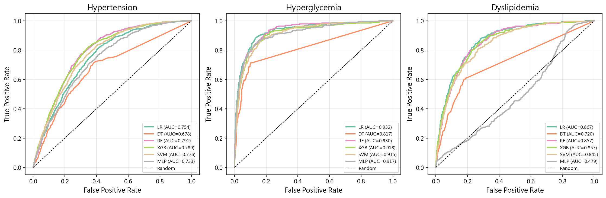
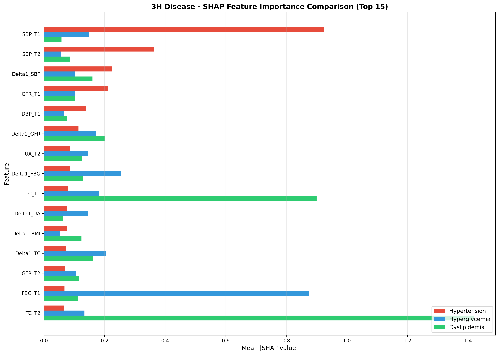
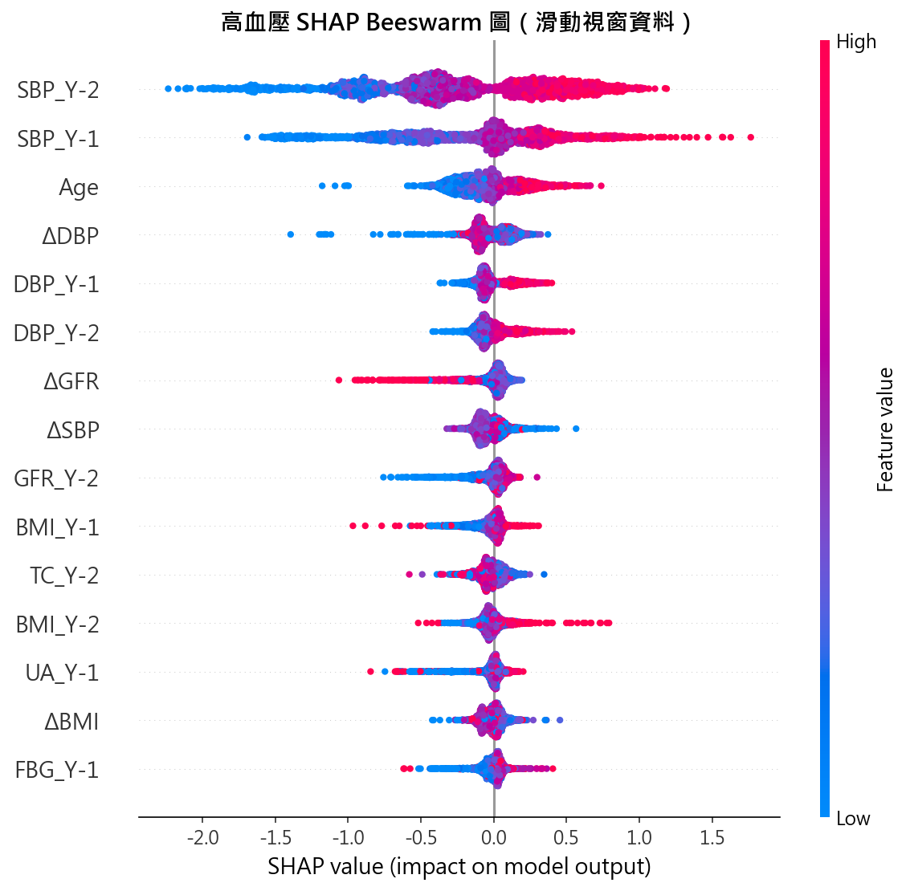
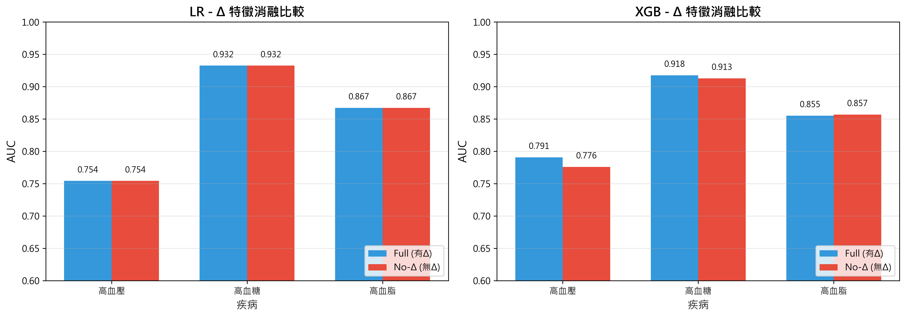
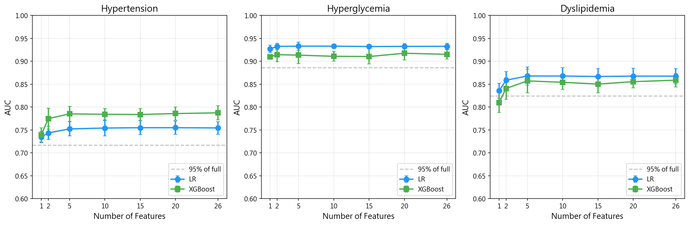
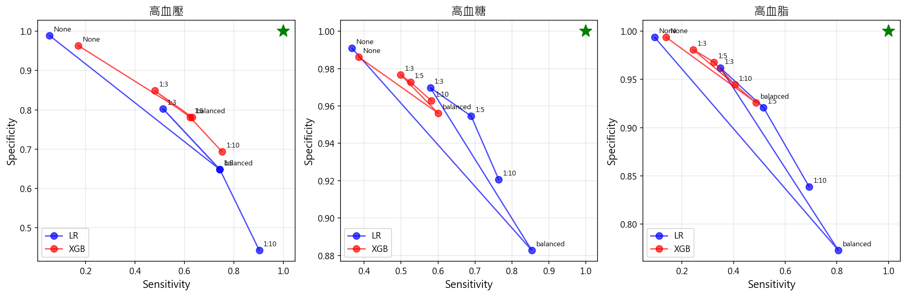
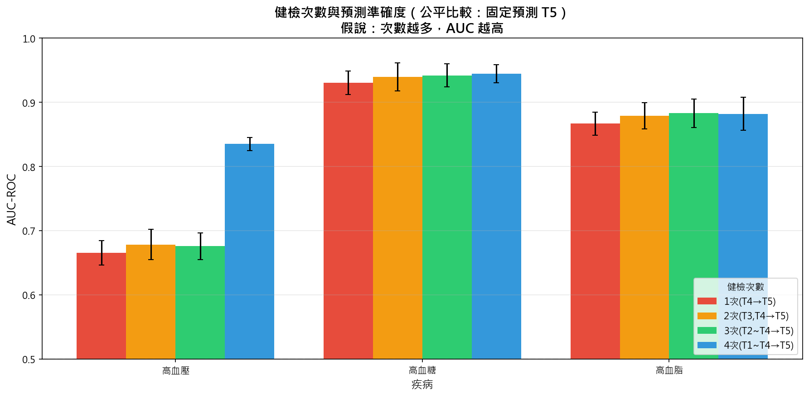

# 第六章 實驗結果

本章呈現各項實驗的結果，包括模型性能比較、特徵重要性分析、消融實驗以及符號回歸實驗。所有實驗皆採用滑動窗口資料集（13,514 筆紀錄）與 StratifiedGroupKFold 5-fold 交叉驗證，確保同一參與者的紀錄不會同時出現在訓練集與測試集中。

## 6.1 模型性能比較

**實驗目的**：回答 Q2（模型選擇與比較）——在三高疾病預測任務中，哪些機器學習模型表現最佳？傳統統計方法與機器學習方法的性能差異為何？

### 6.1.1 整體結果

表 6-1 呈現十種模型在三項預測任務上的 AUC 表現。模型涵蓋傳統統計方法（LR、NB、LDA）、基於實例方法（KNN）、樹模型（DT、RF、XGB、LGBM）、核方法（SVM）及神經網路（MLP）。整體而言，Logistic Regression 在高血糖與高血脂預測中皆達到最高 AUC，尤其高血糖預測達 0.938；高血壓預測則以 Random Forest 表現最佳（AUC 0.743）。

**表 6-1 各模型 AUC 比較（5-Fold CV）**

| 模型 | 高血壓 | 高血糖 | 高血脂 |
|------|--------|--------|--------|
| LR | 0.721 ± 0.017 | **0.938 ± 0.010** | **0.867 ± 0.012** |
| NB | 0.709 ± 0.022 | 0.917 ± 0.010 | 0.847 ± 0.015 |
| LDA | 0.720 ± 0.017 | 0.936 ± 0.011 | 0.867 ± 0.012 |
| KNN | 0.630 ± 0.018 | 0.782 ± 0.020 | 0.673 ± 0.013 |
| DT | 0.658 ± 0.012 | 0.835 ± 0.014 | 0.744 ± 0.037 |
| RF | **0.743 ± 0.013** | 0.932 ± 0.008 | 0.859 ± 0.014 |
| XGB | 0.738 ± 0.012 | 0.930 ± 0.014 | 0.857 ± 0.016 |
| LGBM | 0.730 ± 0.011 | 0.926 ± 0.015 | 0.852 ± 0.011 |
| SVM | 0.726 ± 0.011 | 0.919 ± 0.012 | 0.845 ± 0.012 |
| MLP | 0.703 ± 0.033 | 0.919 ± 0.021 | 0.742 ± 0.136 |

註：粗體表示該疾病最佳結果；所有數值為 mean ± std

圖 6-1 呈現十種模型在三項疾病預測任務上的 ROC 曲線。由圖可知，高血糖預測的 ROC 曲線整體最靠近左上角，高血脂次之，高血壓最低——與表 6-1 的 AUC 數值趨勢一致。

**圖 6-1 各模型 ROC 曲線比較（5-Fold CV）**

### 6.1.2 高血壓預測結果

高血壓預測（陽性率 16.68%）的 AUC 介於 0.630 至 0.743 之間。Random Forest 達到最高的 AUC（0.743），其次為 XGBoost（0.738）與 SVM（0.726）。傳統統計方法中，LR（0.721）與 LDA（0.720）表現接近，NB 略低（0.709）。KNN 表現最差（0.630），而 MLP 則呈現較大的變異（標準差 0.033）。

表 6-2 呈現高血壓預測的完整評估指標。值得注意的是，RF 雖然 AUC 最高，但其 Sensitivity 僅 0.286，顯示模型傾向保守預測。LDA 與 MLP 皆呈現極端的保守預測行為（Sensitivity 分別僅 0.037 與 0.017），幾乎將所有樣本判為非患病。NB 的 Sensitivity（0.357）雖高於 LDA，但仍明顯低於 LR（0.697）。相較之下，LR 與 SVM 在 Sensitivity 與 Specificity 之間取得較佳的平衡。

**表 6-2 高血壓預測詳細結果**

| 模型 | AUC | Sensitivity | Specificity | F1-Score |
|------|-----|-------------|-------------|----------|
| LR | 0.721 | 0.697 | 0.638 | 0.434 |
| NB | 0.709 | 0.357 | 0.832 | 0.347 |
| LDA | 0.720 | 0.037 | 0.988 | 0.068 |
| KNN | 0.630 | 0.116 | 0.946 | 0.172 |
| DT | 0.658 | 0.646 | 0.629 | 0.404 |
| RF | **0.743** | 0.286 | 0.890 | 0.328 |
| XGB | 0.738 | 0.678 | 0.676 | 0.447 |
| LGBM | 0.730 | 0.601 | 0.717 | 0.432 |
| SVM | 0.726 | 0.704 | 0.635 | 0.436 |
| MLP | 0.703 | 0.017 | 0.996 | 0.032 |

### 6.1.3 高血糖預測結果

高血糖預測（陽性率 5.53%）展現最佳的預測效能，除 KNN（0.782）外，其餘模型的 AUC 皆高於 0.83。Logistic Regression 達到最高的 AUC（0.938），其次為 LDA（0.936）、RF（0.932）、XGBoost（0.930）與 LightGBM（0.926）。

**表 6-3 高血糖預測詳細結果**

| 模型 | AUC | Sensitivity | Specificity | F1-Score |
|------|-----|-------------|-------------|----------|
| LR | **0.938** | 0.858 | 0.882 | 0.461 |
| NB | 0.917 | 0.601 | 0.953 | 0.511 |
| LDA | 0.936 | 0.484 | 0.980 | 0.536 |
| KNN | 0.782 | 0.223 | 0.992 | 0.331 |
| DT | 0.835 | 0.763 | 0.887 | 0.431 |
| RF | 0.932 | 0.551 | 0.965 | 0.525 |
| XGB | 0.930 | 0.745 | 0.933 | 0.532 |
| LGBM | 0.926 | 0.646 | 0.954 | 0.542 |
| SVM | 0.919 | 0.721 | 0.922 | 0.488 |
| MLP | 0.919 | 0.304 | 0.988 | 0.399 |

表 6-3 進一步呈現高血糖預測的詳細指標。LR 在 AUC 最高的同時，Sensitivity 亦達 0.858，顯示其能有效識別大多數患病者。相較之下，LDA 雖 AUC 接近（0.936），但 Sensitivity 僅 0.484，約半數患者被漏判。KNN 與 MLP 的 Sensitivity 分別僅 0.223 與 0.304，臨床實用性有限。在 F1-Score 方面，LGBM（0.542）與 LDA（0.536）表現最佳，反映其在 Precision 與 Recall 間取得較好的平衡。整體而言，高血糖因陽性率最低（5.53%），各模型的 F1-Score 普遍偏低（0.331–0.542），顯示在極度不平衡的情境下，單純以 AUC 評估可能高估模型的臨床效用。

### 6.1.4 高血脂預測結果

高血脂預測（陽性率 5.96%）的 AUC 介於 0.673 至 0.867 之間。LR 與 LDA 並列最高 AUC（0.867），RF（0.859）、XGBoost（0.857）與 LightGBM（0.852）緊隨其後。KNN 表現最差（0.673），而 MLP 呈現最大的不穩定性（標準差 0.136）。

**表 6-4 高血脂預測詳細結果**

| 模型 | AUC | Sensitivity | Specificity | F1-Score |
|------|-----|-------------|-------------|----------|
| LR | **0.867** | 0.799 | 0.775 | 0.362 |
| NB | 0.847 | 0.416 | 0.941 | 0.396 |
| LDA | **0.867** | 0.118 | 0.991 | 0.193 |
| KNN | 0.673 | 0.061 | 0.992 | 0.105 |
| DT | 0.744 | 0.673 | 0.785 | 0.323 |
| RF | 0.859 | 0.391 | 0.942 | 0.378 |
| XGB | 0.857 | 0.676 | 0.844 | 0.388 |
| LGBM | 0.852 | 0.561 | 0.891 | 0.397 |
| SVM | 0.845 | 0.695 | 0.821 | 0.368 |
| MLP | 0.742 | 0.066 | 0.995 | 0.108 |

高血脂預測呈現與高血壓類似的 Sensitivity 極化現象。LR 的 Sensitivity 最高（0.799），其次為 SVM（0.695）與 XGBoost（0.676），而 LDA（0.118）、KNN（0.061）與 MLP（0.066）幾乎喪失識別患病者的能力。值得注意的是，LDA 雖與 LR 並列最高 AUC（0.867），但 Sensitivity 相差近 7 倍（0.118 vs 0.799），凸顯 AUC 作為單一指標的局限性。MLP 的標準差高達 0.136，遠超其他模型（均 < 0.04），顯示其在此預測任務中的訓練不穩定。

### 6.1.5 過擬合檢查

為評估各模型的泛化能力，本研究比較訓練集與測試集的 AUC 差異（Gap = Train AUC − Test AUC）。Gap 越大表示模型過擬合越嚴重，即模型在訓練資料上的表現遠優於未見過的測試資料。

**表 6-5 各模型訓練集 AUC 與泛化差距（5-Fold CV）**

| 模型 | 高血壓 Train | Gap | 高血糖 Train | Gap | 高血脂 Train | Gap |
|------|:----------:|:---:|:----------:|:---:|:----------:|:---:|
| LR   | 0.724 | 0.003 | 0.940 | 0.003 | 0.871 | 0.004 |
| NB   | 0.712 | 0.003 | 0.919 | 0.002 | 0.857 | 0.010 |
| LDA  | 0.724 | 0.004 | 0.938 | 0.001 | 0.870 | 0.003 |
| KNN  | 0.863 | 0.234 | 0.976 | 0.194 | 0.937 | 0.264 |
| DT   | 0.853 | 0.195 | 0.980 | 0.145 | 0.944 | 0.201 |
| RF   | 0.997 | **0.254** | 0.996 | 0.064 | 0.993 | 0.134 |
| XGB  | 0.909 | 0.170 | 0.995 | 0.064 | 0.974 | 0.117 |
| LGBM | 0.969 | 0.239 | 1.000 | 0.074 | 0.997 | 0.146 |
| SVM  | 0.863 | 0.137 | 0.983 | 0.063 | 0.946 | 0.101 |
| MLP  | 0.712 | 0.009 | 0.935 | 0.015 | 0.763 | 0.021 |

註：Test AUC 見表 6-1；Gap = Train AUC − Test AUC

由表 6-5 可觀察到三種截然不同的泛化模式：

1. **傳統統計方法**（LR、NB、LDA）：Gap 極小（≤ 0.010），幾乎不存在過擬合。線性模型的低模型容量在 26 個特徵的結構化資料上不易過度擬合訓練資料。

2. **樹模型與核方法**（RF、XGB、LGBM、SVM）：Gap 介於 0.063 至 0.254。其中 RF 的過擬合最為嚴重——高血壓的訓練集 AUC 達 0.997（近乎完美記憶），但測試集僅 0.743（Gap 0.254）。LGBM 在高血糖任務中訓練集 AUC 達 1.000，亦呈現完全記憶的行為。然而，儘管過擬合明顯，這些模型的測試集 AUC 仍高於 DT 與 KNN，顯示集成方法在部分過擬合的情況下仍能保留有效的泛化特徵。

3. **MLP 與 KNN/DT**：MLP 的 Gap 偏低（0.009–0.021），但其測試集表現不穩定（高血脂 AUC 標準差 0.136），顯示問題在於訓練不穩定而非過擬合。KNN 與 DT 則同時呈現高 Gap（0.145–0.264）與低測試集 AUC，為過擬合最嚴重且泛化能力最差的兩個模型。

此分析呼應 §6.1.1 的觀察：傳統統計方法（尤其 LR）在結構化健檢資料上不僅測試集 AUC 高，泛化能力亦最佳。樹模型雖然測試集 AUC 可與 LR 相近（如 RF 高血壓 0.743 vs LR 0.721），但其訓練集-測試集差距顯示模型利用了訓練資料中的雜訊特徵，泛化穩健性較差。

## 6.2 特徵重要性分析

**實驗目的**：回答 Q4（特徵重要性分析）——哪些生物標記及其變化量對三高疾病預測最為重要？Δ 特徵在重要特徵中的佔比為何？

### 6.2.1 SHAP 特徵重要性

本研究使用 SHAP（SHapley Additive exPlanations）分析 XGBoost 模型的特徵重要性。表 6-6 呈現三項疾病的 Top 10 重要特徵。

**表 6-6 各疾病 Top 10 重要特徵（SHAP）**

| 排名 | 高血壓 | 高血糖 | 高血脂 |
|------|--------|--------|--------|
| 1 | SBP_Y-2 | FBG_Y-1 | TC_Y-1 |
| 2 | SBP_Y-1 | FBG_Y-2 | TC_Y-2 |
| 3 | Age | ΔTC | ΔeGFR |
| 4 | ΔDBP | BMI_Y-1 | Age |
| 5 | DBP_Y-1 | BMI_Y-2 | eGFR_Y-2 |
| 6 | DBP_Y-2 | ΔUA | ΔTC |
| 7 | ΔeGFR | ΔeGFR | BMI_Y-1 |
| 8 | ΔSBP | ΔFBG | DBP_Y-1 |
| 9 | eGFR_Y-2 | eGFR_Y-2 | ΔUA |
| 10 | BMI_Y-1 | UA_Y-1 | FBG_Y-1 |

由表 6-6 可觀察到，各疾病的最重要特徵與其直接相關的生物標記高度吻合：高血壓以收縮壓（SBP）與舒張壓（DBP）為主、高血糖以空腹血糖（FBG）為主、高血脂以總膽固醇（TC）為主。此外，同一指標的兩個時間點（Y-2 與 Y-1）通常同時出現在 Top 10 中，顯示模型同時參考歷史趨勢與近期數值。年齡（Age）在高血壓與高血脂中皆進入前四名，反映年齡作為慢性病共通風險因子的角色。ΔeGFR 則同時出現在三項疾病的 Top 10 中，暗示腎功能變化可能是三高疾病的共通預測指標。

圖 6-2 以水平長條圖呈現三項疾病的 Top 10 重要特徵比較，可直觀觀察各特徵對不同疾病的相對重要程度。

**圖 6-2 三項疾病 SHAP 特徵重要性比較（XGBoost, Top 10）**

### 6.2.2 Δ 特徵在 Top 10 中的佔比

在 Top 10 重要特徵中，Δ 特徵的佔比如表 6-7 所示：

**表 6-7 各疾病 Top 10 中 Δ 特徵數量**

| 疾病 | Δ 特徵數量 | 佔比 |
|------|------------|------|
| 高血壓 | 3 (ΔDBP, ΔeGFR, ΔSBP) | 30% |
| 高血糖 | 4 (ΔTC, ΔUA, ΔeGFR, ΔFBG) | 40% |
| 高血脂 | 3 (ΔeGFR, ΔTC, ΔUA) | 30% |

Δ 特徵在 Top 10 中的佔比為高血壓 30%、高血糖 40%、高血脂 30%，顯示 XGBoost 確實直接利用變化量進行決策分裂。然而，此佔比反映的是模型對變化量資訊的利用偏好，而非預測力的獨立貢獻——§6.3 消融實驗將顯示，當模型同時擁有 Y-2 與 Y-1 原始值時，移除 Δ 特徵對 AUC 無影響。Δ 特徵在 SHAP 分析中的佔比，其核心價值在於提升臨床可解釋性（詳見 §7.2.2 討論）。值得注意的是，ΔeGFR 為唯一同時出現在三項疾病 Top 10 的 Δ 特徵，呼應腎功能變化作為代謝異常早期指標的臨床觀點。

圖 6-3 以高血壓為例，呈現 SHAP beeswarm 圖。每個點代表一筆樣本，橫軸為 SHAP 值（對預測的影響方向與大小），顏色代表特徵值的高低。

**圖 6-3 高血壓預測 SHAP Beeswarm 圖（XGBoost）**

## 6.3 Δ 特徵消融實驗

**實驗目的**：回答 Q1（變化量特徵的預測價值）——額外納入 Δ 特徵是否能顯著提升三高疾病的預測性能？

### 6.3.1 實驗設計

為驗證 Δ 特徵的預測價值，本研究設計兩組比較框架：

1. **比較框架 1**：Full (Y-2 + Y-1 + Δ) vs No-Delta (Y-2 + Y-1)
   - 目的：在完整特徵集中移除 Δ 特徵的影響

2. **比較框架 2**：Y-1 + Δ vs Y-1 Only
   - 目的：在僅有單一時間點資料時，評估 Δ 特徵的增量價值

### 6.3.2 比較框架 1 結果

移除 Δ 特徵後，三種疾病的 AUC 與 Sensitivity 均無變化（表 6-8），顯示在已包含 Y-2 與 Y-1 兩個時間點靜態特徵的情況下，Δ 特徵未能提供額外的預測資訊。此結果在統計上合理：由於 Δ = Y-1 − Y-2，LR 等線性模型可直接從 Y-2 與 Y-1 的係數差隱含地計算出等效的變化量效果，因此 Δ 特徵在 Full 特徵集中屬於冗餘資訊。

**表 6-8 Full vs No-Delta 比較（LR 模型）**

| 疾病 | 指標 | Full (26 特徵) | No-Delta (18 特徵) | 差異 |
|------|------|----------------|-------------------|------|
| 高血壓 | AUC | 0.721 | 0.721 | 0.0% |
| | Sensitivity | 0.697 | 0.697 | 0.0% |
| 高血糖 | AUC | 0.938 | 0.938 | 0.0% |
| | Sensitivity | 0.858 | 0.857 | −0.1% |
| 高血脂 | AUC | 0.867 | 0.867 | 0.0% |
| | Sensitivity | 0.799 | 0.798 | −0.1% |

### 6.3.3 比較框架 2 結果

當模型僅有 Y-1 資料時，加入 Δ 特徵可帶來 1.5%–2.3% 的 AUC 提升（表 6-9）。三項疾病均呈現一致的改善趨勢，其中高血壓的提升幅度最大（+2.3%）。值得注意的是，Sensitivity 的提升幅度更為顯著（+0.8% 至 +3.7%），顯示 Δ 特徵的加入不僅提升排序能力，更有效改善了對患病個體的識別率。此結果對僅有單次健檢紀錄的臨床場景具有實務意義：透過計算兩次健檢間的變化量，即可在不增加健檢項目的前提下提升預測效能。

**表 6-9 Y-1 + Δ vs Y-1 Only 比較（LR 模型）**

| 疾病 | 指標 | Y-1 + Δ (18 特徵) | Y-1 Only (10 特徵) | 提升 |
|------|------|-------------------|-------------------|------|
| 高血壓 | AUC | 0.721 | 0.698 | **+2.3%** |
| | Sensitivity | 0.697 | 0.660 | **+3.7%** |
| 高血糖 | AUC | 0.938 | 0.923 | **+1.5%** |
| | Sensitivity | 0.857 | 0.824 | **+3.3%** |
| 高血脂 | AUC | 0.867 | 0.846 | **+2.1%** |
| | Sensitivity | 0.798 | 0.790 | **+0.8%** |

圖 6-4 以長條圖呈現 LR 與 XGBoost 兩種模型在 Full vs No-Delta 條件下的 AUC 比較。兩種模型在三項疾病中均呈現相似的模式：移除 Δ 特徵對 AUC 的影響極小，進一步支持比較框架 1 的結論。

**圖 6-4 Δ 特徵消融實驗結果（Full vs No-Delta）**

## 6.4 特徵選擇消融實驗

**實驗目的**：回答 Q5（模型精簡的可行性）——使用少量關鍵特徵是否能維持接近完整模型的預測性能？

### 6.4.1 實驗設計

為評估精簡特徵集的可行性，本研究依據 SHAP 特徵重要性排序，測試使用 Top 1、Top 2、Top 5、Top 10、Top 15、Top 20 與全部 26 個特徵的預測效能。

### 6.4.2 實驗結果

表 6-10 呈現不同特徵數量下 LR 與 XGBoost 的 AUC 表現。

**表 6-10 特徵選擇消融實驗結果**

| 特徵數 | 高血壓 (LR) | 高血壓 (XGB) | 高血糖 (LR) | 高血糖 (XGB) | 高血脂 (LR) | 高血脂 (XGB) |
|--------|-------------|--------------|-------------|--------------|-------------|--------------|
| 1 | 0.686 | 0.739 | 0.920 | 0.909 | 0.805 | 0.809 |
| 2 | 0.743 | 0.775 | 0.932 | 0.914 | 0.858 | 0.840 |
| 5 | 0.752 | 0.785 | 0.933 | 0.913 | 0.868 | 0.857 |
| 10 | 0.754 | 0.784 | 0.933 | 0.911 | 0.868 | 0.854 |
| 15 | 0.755 | 0.784 | 0.932 | 0.910 | 0.867 | 0.850 |
| 20 | 0.755 | 0.786 | 0.932 | 0.917 | 0.867 | 0.855 |
| 26 | 0.754 | 0.787 | 0.932 | 0.915 | 0.867 | 0.859 |

由表 6-10 可觀察到，預測力高度集中在少量核心特徵。僅使用 Top 2 特徵（即同一生物標記的兩個時間點），高血壓 AUC 即達 0.743（較全特徵僅降 1.5%），高血糖達 0.932（與全特徵相同），高血脂達 0.858（僅降 1.0%）。進一步精簡至 Top 1 時，高血糖仍維持 0.920 的高 AUC，但高血壓（0.686）與高血脂（0.805）則出現較明顯的下降，顯示第二時間點對這兩項疾病的增量價值較大。Top 5 至 Top 26 的 AUC 差異均在 0.005 以內，增加更多特徵已無實質改善。對照表 6-6 的 SHAP 排序可知，Top 2 特徵均為同一核心生物標記的兩個時間點（SBP、FBG、TC），印證預測力集中在直接相關的生物標記上。此結果為臨床場景中的精簡篩檢方案提供了實證基礎：僅需追蹤兩次核心指標，即可達到接近完整模型的預測效能。

圖 6-5 以折線圖呈現不同特徵數量下 LR 與 XGBoost 的 AUC 變化趨勢，虛線標示全特徵 AUC 的 95% 門檻。

**圖 6-5 特徵數量與 AUC 關係（LR vs XGBoost）**

## 6.5 類別不平衡處理比較

**實驗目的**：驗證類別不平衡處理策略的穩健性——比較 class_weight、SMOTE、ADASYN 等方法對模型效能的影響，選定最適合實務應用的方案。

### 6.5.1 實驗設計

由於三高疾病的陽性率介於 5.5% 至 16.7%，類別不平衡可能影響模型效能。本研究分兩階段進行比較：

1. **方法比較**：比較五種類別不平衡處理方法（Baseline、class_weight、SMOTE、ADASYN、RandomUnderSampler）。
2. **權重設定比較**：針對 class_weight 方法，進一步比較不同權重設定（None、balanced、1:3、1:5、1:10）。

### 6.5.2 方法比較結果

表 6-11 呈現五種類別不平衡處理方法的 AUC 與 Sensitivity 比較。

**表 6-11 類別不平衡處理方法比較（LR 模型）**

| 疾病 | 指標 | Baseline | class_weight | SMOTE | ADASYN | UnderSampling |
|------|------|----------|-------------|-------|--------|---------------|
| 高血壓 | AUC | 0.719 | 0.720 | 0.719 | 0.719 | 0.719 |
|  | Sens | 0.041 | 0.698 | 0.698 | 0.696 | 0.699 |
| 高血糖 | AUC | 0.937 | 0.937 | 0.937 | 0.936 | 0.937 |
|  | Sens | 0.335 | 0.861 | 0.852 | 0.877 | 0.864 |
| 高血脂 | AUC | 0.863 | 0.864 | 0.863 | 0.863 | 0.862 |
|  | Sens | 0.135 | 0.791 | 0.785 | 0.794 | 0.790 |

由表 6-11 可觀察到兩項關鍵發現：

1. **AUC 幾乎無差異**：五種方法的 AUC 差異均小於 0.2%，顯示類別不平衡處理策略不影響模型的整體判別能力。
2. **Sensitivity 大幅改善**：相較於 Baseline（未處理），四種處理方法皆可將 Sensitivity 從極低值（高血壓 0.041、高血糖 0.335、高血脂 0.135）提升至 0.70-0.88，改善幅度達 50-70 個百分點。此結果顯示，類別不平衡處理的核心作用並非提升模型判別力，而是調整 Sensitivity-Specificity 的權衡點，使模型不再偏向多數類別。
3. **方法間差異極小**：class_weight、SMOTE、ADASYN 與 RandomUnderSampler 四種方法的 Sensitivity 差異 < 2%，而 class_weight 不需生成合成樣本、不改變資料分佈，為最簡便的實務選擇。

### 6.5.3 權重設定比較結果

表 6-12 呈現不同 class_weight 設定的比較結果。

**表 6-12 不同 class_weight 設定比較（LR 模型）**

| 疾病 | 指標 | None | balanced | 1:3 | 1:5 | 1:10 |
|------|------|------|----------|-----|-----|------|
| 高血壓 | AUC | 0.754 | 0.754 | 0.754 | 0.754 | 0.754 |
|  | Sens | 0.053 | 0.744 | 0.513 | 0.744 | 0.903 |
| 高血糖 | AUC | 0.933 | 0.932 | 0.934 | 0.934 | 0.933 |
|  | Sens | 0.367 | 0.854 | 0.579 | 0.690 | 0.764 |
| 高血脂 | AUC | 0.867 | 0.867 | 0.868 | 0.868 | 0.867 |
|  | Sens | 0.094 | 0.806 | 0.349 | 0.515 | 0.693 |

圖 6-6 以散佈圖呈現不同 class_weight 設定下 Sensitivity 與 Specificity 的權衡關係。

**圖 6-6 不同 class_weight 設定下的 Sensitivity-Specificity 權衡（LR 模型）**

由表 6-12 與圖 6-6 可見，不同 class_weight 設定呈現清晰的 Sensitivity-Specificity 權衡：從 None 到 1:10，Sensitivity 逐步上升而 Specificity 下降，AUC 則維持不變（差異 < 0.2%）。balanced 設定在三種疾病中皆取得 Sensitivity 0.74-0.85 的水準，同時維持合理的 Specificity，適合疾病篩檢應用場景。

## 6.6 資料篩選策略比較

**實驗目的**：驗證資料處理策略的穩健性——排除基線已確診個案是否影響預測效能？確保主要實驗結果不受資料篩選方式左右。

### 6.6.1 實驗設計

滑動窗口法使同一參與者可產生多筆樣本，其中部分窗口的起點（Y-2）可能已有目標疾病。這些「非新發」個案是否應該排除？由於 Luo et al. [18] 的世代篩選流程已隱含基線健康篩選——受試者首次健檢（Times=1）時三高疾病盛行率接近 0%——排除首次健檢已確診者對資料集無實質影響。因此，本實驗聚焦於以下兩策略的比較：

- **策略 A（本研究採用）**：包含所有滑動窗口樣本（13,514 筆）。
- **策略 C**：排除每個滑動窗口中，Y-2 時生理指標已超過診斷閾值的樣本。

診斷閾值依據 Luo et al. [18]：高血壓 SBP ≥ 140 或 DBP ≥ 90 mmHg、高血糖 FBG ≥ 7.0 mmol/L、高血脂 TC ≥ 6.22 mmol/L。

### 6.6.2 排除統計

表 6-13 呈現各疾病在策略 C 下的排除統計（原始樣本數皆為 13,514 筆）。

**表 6-13 策略 C 排除統計**

| 疾病 | Y-2 已確診 | 排除後樣本數 | 原始陽性率 | 排除後陽性率 |
|------|---------------|-------------|-----------|-------------|
| 高血壓 | 1,402 (10.4%) | 12,112 | 19.3% | 17.9% |
| 高血糖 | 367 (2.7%) | 13,147 | 5.9% | 4.6% |
| 高血脂 | 548 (4.1%) | 12,966 | 7.9% | 6.8% |

高血壓的 Y-2 已確診比例最高（10.4%），排除後陽性率從 19.3% 降至 17.9%。高血糖與高血脂的排除比例較低（2.7% 與 4.1%），對陽性率的影響亦較小。

### 6.6.3 實驗結果

**表 6-14 排除策略 AUC 比較（5-Fold CV）**

| 疾病 | 模型 | A（全部樣本） | C（排除已確診） | 差異 |
|------|------|-------------|---------------|------|
| 高血壓 | LR | 0.712 ± 0.015 | 0.710 ± 0.011 | -0.3% |
| 高血壓 | RF | 0.735 ± 0.012 | 0.748 ± 0.014 | +1.3% |
| 高血糖 | LR | 0.922 ± 0.017 | 0.910 ± 0.018 | -1.1% |
| 高血糖 | RF | 0.924 ± 0.011 | 0.917 ± 0.014 | -0.8% |
| 高血脂 | LR | 0.858 ± 0.012 | 0.854 ± 0.011 | -0.4% |
| 高血脂 | RF | 0.851 ± 0.017 | 0.844 ± 0.012 | -0.6% |

由表 6-14 可見，兩種策略的 AUC 差異均在 1.3% 以內，且無一致性方向（高血壓 RF 略升 +1.3%，其餘皆略降）。此結果驗證了本研究採用策略 A（包含所有樣本）的合理性：排除基線已確診個案並未帶來系統性的效能改善，而保留全部樣本可維持較大的訓練資料量與統計效力。

## 6.7 健檢次數與預測效能

**實驗目的**：回答 Q6（健檢次數對預測性能的影響）——累積更多次健檢紀錄是否能提升預測準確度？

### 6.7.1 實驗設計

為探討縱向健檢資料的累積效益，本研究設計健檢次數比較實驗。固定以預測年（Y）作為預測目標，逐步增加輸入的歷史健檢次數：1 次（僅 Y-1）、2 次（Y-2、Y-1）、3 次（Y-3～Y-1）、4 次（Y-4～Y-1），比較不同健檢次數下 LR 模型的 AUC 表現。為確保公平比較，四組實驗使用相同的 2,526 名參與者（即具有完整 5 次健檢紀錄者）。

### 6.7.2 實驗結果

圖 6-7 呈現不同健檢次數下三項疾病的 AUC 比較。

**圖 6-7 健檢次數與預測準確度（LR 模型，固定預測 Y）**

由圖 6-7 可觀察到，高血糖與高血脂的 AUC 隨健檢次數增加呈現緩步上升趨勢，但增幅有限（約 1–2%）。高血壓的表現較為特殊：1 至 3 次健檢的 AUC 維持在約 0.67–0.68 的水準，但在 4 次健檢時出現明顯跳升至約 0.84，顯示更長期的血壓變化趨勢對高血壓預測具有較大的增量價值。整體而言，2 次健檢（即本研究的主要實驗設定）已能提供穩定的預測基礎，但累積更多健檢紀錄仍有潛在的效能提升空間，尤其是高血壓預測。

## 6.8 多任務學習與單任務學習比較

**實驗目的**：回答 Q3（多任務學習的效果）——同時預測三高疾病（MTL）相較於分別預測單一疾病（STL），在預測性能上有何差異？

### 6.8.1 實驗設計

本研究的三項預測目標（高血壓、高血糖、高血脂）皆來自相同的健檢資料與特徵集，適合以多任務學習（Multi-Task Learning, MTL）架構同時預測。為比較 MTL 與獨立訓練三個模型的單任務學習（Single-Task Learning, STL）在預測性能上的差異，本研究設計以下比較實驗：

- **MTL 架構**：共享底層神經網路（64 → 32 節點），頂部設置三個獨立輸出頭，分別對應三項疾病。損失函數為三項任務的加權平均。
- **STL 架構**：針對每項疾病各自訓練一個獨立的 MLP 模型，網路結構與 MTL 的單任務路徑相同（64 → 32 → 1）。

兩組實驗使用相同的滑動窗口資料集與 StratifiedGroupKFold 5-fold 交叉驗證。

### 6.8.2 實驗結果

表 6-15 呈現 MTL 與 STL 在三項疾病的多項指標比較。

**表 6-15 MTL vs STL 比較（MLP 模型）**

| 疾病 | 指標 | MTL | STL | 差異 |
|------|------|-----|-----|------|
| 高血壓 | AUC | 0.733 | 0.742 | -0.9% |
|  | Sensitivity | 0.797 | 0.798 | -0.001 |
|  | Specificity | 0.564 | 0.581 | -0.017 |
| 高血糖 | AUC | 0.932 | 0.933 | -0.1% |
|  | Sensitivity | 0.860 | 0.874 | -0.014 |
|  | Specificity | 0.870 | 0.870 | 0.000 |
| 高血脂 | AUC | 0.868 | 0.869 | -0.1% |
|  | Sensitivity | 0.828 | 0.819 | +0.009 |
|  | Specificity | 0.757 | 0.765 | -0.008 |

MTL 與 STL 的 AUC 差異極小（平均僅 -0.4%），且三項疾病的差異方向一致（MTL 皆略低於 STL）。Sensitivity 與 Specificity 的差異同樣有限（|差異| ≤ 0.017），未呈現一致的優劣方向——高血脂的 Sensitivity 在 MTL 中反而略高（+0.009），顯示兩種架構在分類指標層面亦無系統性差異。

在計算效率方面，MTL 架構以 3,907 個參數（共享底層 + 3 個輸出頭）取代 STL 的 11,523 個參數（3 個獨立網路），參數量節省 66%。訓練時間 MTL 平均每折 11.0 秒，較 STL 的 15.9 秒快約 1.4 倍。儘管 MTL 在參數效率與訓練速度上具有優勢，但在預測性能上未能超越 STL，可能的原因是三項疾病的主要預測特徵差異較大（如高血壓以 SBP/DBP 為主、高血糖以 FBG 為主），共享表徵反而略微稀釋了各任務的專屬資訊。基於此結果，本研究的主要實驗採用 STL 架構，分別訓練三項疾病的獨立模型。

## 6.9 符號回歸實驗

**實驗目的**：探索可解釋的數學公式——能否從資料中發現簡潔的預測公式，兼顧預測效能與臨床可解釋性？

### 6.9.1 實驗設計

符號回歸使用 PySR 套件，嘗試從資料中自動發現可解釋的數學公式。實驗設定：最大複雜度 35、迭代次數 200、運算子包含 +、-、*、/、exp。

### 6.9.2 發現的公式

表 6-16 呈現各疾病的最佳符號回歸公式。

**表 6-16 符號回歸發現的公式**

| 疾病 | 公式 | AUC | 訓練時間 |
|------|------|-----|----------|
| 高血壓 | $0.130 \times \exp(SBP_{Y-2})$ | 0.745 | 20.7 分鐘 |
| 高血糖 | $0.114 \times FBG_{Y-1}$ | 0.943 | 20.6 分鐘 |
| 高血脂 | $0.043 \times \exp(TC_{Y-2})$ | 0.801 | 20.8 分鐘 |

PySR 發現的公式呈現高度簡潔性：三項疾病的預測公式均僅依賴單一特徵，且該特徵恰好是 SHAP 分析中排名第一的重要特徵（高血壓：SBP_Y-2、高血糖：FBG_Y-1、高血脂：TC_Y-2）。高血糖的公式最為簡單——直接以 FBG_Y-1 的線性函數預測，即可達到 0.943 的 AUC，甚至略高於 XGBoost（0.930）。高血壓與高血脂的公式則使用指數函數，反映這兩項疾病與對應生物標記之間的非線性關係。從臨床可解釋性的角度，這些公式直觀地呈現了「血壓高→高血壓風險高」、「血糖高→高血糖風險高」的醫學常識，驗證了模型學習到的特徵與臨床知識一致。然而，高血脂公式的 AUC（0.801）較完整模型（0.867）低 7.6%，顯示單一特徵在此任務中的預測力有限。

### 6.9.3 穩定性驗證

為評估上述公式的穩定性，本研究進一步以 StratifiedGroupKFold 5-fold 交叉驗證重複執行 PySR 實驗（參數設定同 §6.9.1）。表 6-17 呈現穩定性驗證結果。

**表 6-17 符號回歸 5-Fold CV 穩定性結果**

| 疾病 | 有效公式 | 5-Fold 平均 AUC | 表 6-16 AUC |
|------|---------|----------------|------------|
| 高血壓 | 2/5 折 | 0.580 ± 0.110 | 0.745 |
| 高血糖 | 5/5 折 | 0.918 ± 0.016 | 0.943 |
| 高血脂 | 2/5 折 | 0.640 ± 0.192 | 0.801 |

註：「有效公式」指非常數解；常數解的 AUC = 0.500（無判別力）

穩定性驗證揭示顯著的疾病間差異。高血糖的公式最為穩定：五折均收斂至相同的結構（0.114–0.120 × FBG_Y-1），AUC 標準差僅 0.016，公式形式與表 6-16 的最佳結果一致。相對地，高血壓與高血脂各有 3/5 折退化為常數解（AUC = 0.500），僅 2 折產出有效的線性公式，導致 5-fold 平均 AUC 大幅低於最佳單次結果。高血壓的有效折公式使用 SBP_Y-1（而非表 6-16 的 SBP_Y-2），高血脂亦出現 TC_Y-1 與 TC_Y-2 的不一致，進一步反映搜索過程的不穩定性。

基於上述穩定性限制，本研究將符號回歸定位為**探索性實驗**：其發現的簡潔公式具有臨床直覺價值——尤其高血糖的 0.114 × FBG_Y-1 在五折驗證中展現高度穩定性——但高血壓與高血脂的公式不具備交叉驗證層面的可重複性，不宜作為獨立預測工具。

---

撰寫狀態：章節重組完成
最後更新：2026-02-24
維護者：紀伯喬
