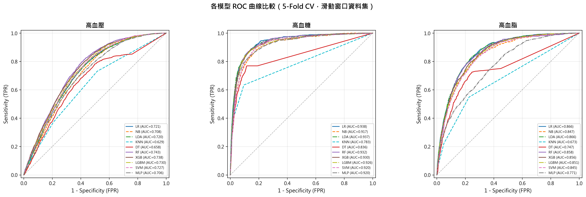
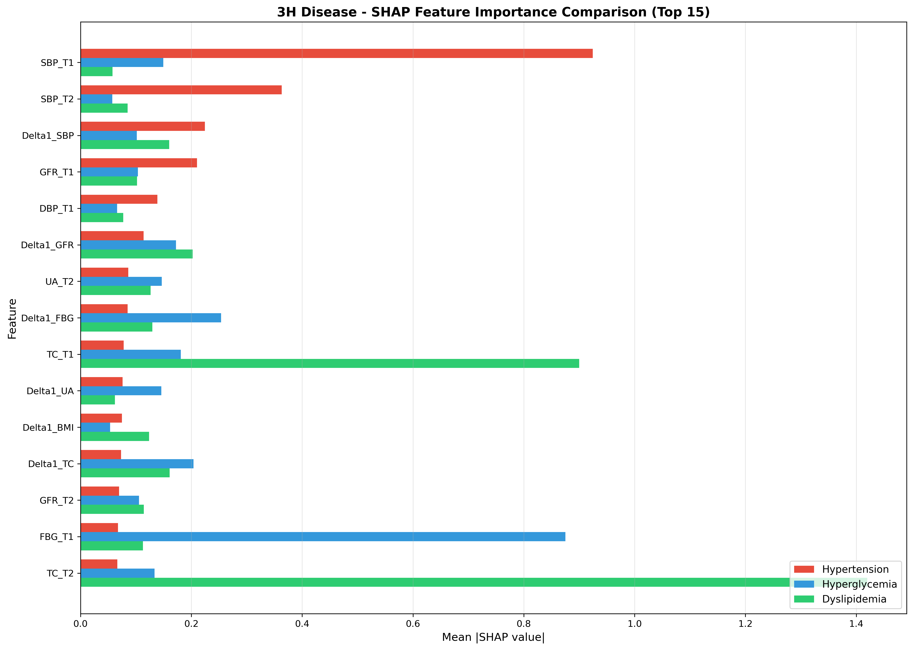
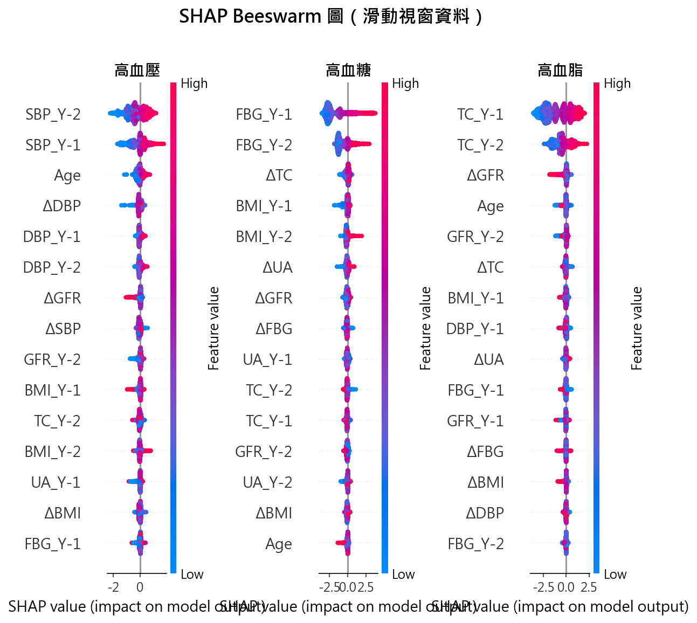
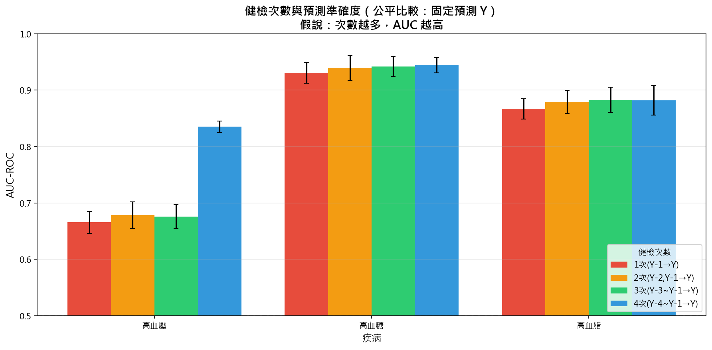

# 第四章 實驗結果

本章呈現各項實驗的結果，包括模型性能比較、特徵重要性分析、消融實驗以及符號回歸實驗。所有實驗皆採用滑動窗口資料集（13,514 筆紀錄）與 StratifiedGroupKFold 5-fold 交叉驗證，確保同一參與者的紀錄不會同時出現在訓練集與測試集中。

## 4.1 模型性能比較

### 4.1.1 整體結果

表 4-1 呈現八種模型在三項預測任務上的 AUC 表現。模型涵蓋傳統統計方法（LR、NB、LDA）、樹模型（DT、RF、XGB）、核方法（SVM）及神經網路（MLP）。整體而言，Logistic Regression 在高血糖與高血脂預測中皆達到最高 AUC，尤其高血糖預測達 0.938；高血壓預測則以 Random Forest 表現最佳（AUC 0.743）。

**表 4-1 各模型 AUC 比較（5-Fold CV）**

| 模型 | 類型 | 高血壓 | 高血糖 | 高血脂 |
|------|------|--------|--------|--------|
| LR | 傳統統計 | 0.721 ± 0.017 | **0.938 ± 0.010** | **0.867 ± 0.012** |
| NB | 傳統統計 | 0.709 ± 0.022 | 0.917 ± 0.010 | 0.847 ± 0.015 |
| LDA | 傳統統計 | 0.720 ± 0.017 | 0.936 ± 0.011 | 0.867 ± 0.012 |
| DT | 樹模型 | 0.658 ± 0.012 | 0.835 ± 0.014 | 0.744 ± 0.037 |
| RF | 樹模型 | **0.743 ± 0.013** | 0.932 ± 0.008 | 0.859 ± 0.014 |
| XGB | 樹模型 | 0.738 ± 0.012 | 0.930 ± 0.014 | 0.857 ± 0.016 |
| SVM | 核方法 | 0.726 ± 0.011 | 0.919 ± 0.012 | 0.845 ± 0.012 |
| MLP | 神經網路 | 0.703 ± 0.033 | 0.919 ± 0.021 | 0.742 ± 0.136 |

註：粗體表示該疾病最佳結果；所有數值為 mean ± std

圖 4-1 呈現八種模型在三項疾病預測任務上的 ROC 曲線。由圖可知，高血糖預測的 ROC 曲線整體最靠近左上角，高血脂次之，高血壓最低——與表 4-1 的 AUC 數值趨勢一致。

**圖 4-1 各模型 ROC 曲線比較（5-Fold CV）**

### 4.1.2 高血壓預測結果

高血壓預測（陽性率 16.68%）的 AUC 介於 0.658 至 0.743 之間。Random Forest 達到最高的 AUC（0.743），其次為 XGBoost（0.738）與 SVM（0.726）。傳統統計方法中，LDA（0.720）與 LR（0.721）表現接近，NB 略低（0.709）。Decision Tree 表現最差（0.658），而 MLP 則呈現較大的變異（標準差 0.033）。

表 4-2 呈現高血壓預測的完整評估指標。值得注意的是，RF 雖然 AUC 最高，但其 Sensitivity 僅 0.286，顯示模型傾向保守預測。LDA 與 MLP 皆呈現極端的保守預測行為（Sensitivity 分別僅 0.037 與 0.017），幾乎將所有樣本判為非患病。NB 的 Sensitivity（0.357）雖高於 LDA，但仍明顯低於 LR（0.697）。相較之下，LR 與 SVM 在 Sensitivity 與 Specificity 之間取得較佳的平衡。

**表 4-2 高血壓預測詳細結果**

| 模型 | AUC | Sensitivity | Specificity | F1-Score |
|------|-----|-------------|-------------|----------|
| LR | 0.721 | 0.697 | 0.638 | 0.434 |
| NB | 0.709 | 0.357 | 0.832 | 0.347 |
| LDA | 0.720 | 0.037 | 0.988 | 0.068 |
| DT | 0.658 | 0.646 | 0.629 | 0.404 |
| RF | **0.743** | 0.286 | 0.890 | 0.328 |
| XGB | 0.738 | 0.678 | 0.676 | 0.447 |
| SVM | 0.726 | 0.704 | 0.635 | 0.436 |
| MLP | 0.703 | 0.017 | 0.996 | 0.032 |

### 4.1.3 高血糖預測結果

高血糖預測（陽性率 5.53%）展現最佳的預測效能，所有模型的 AUC 皆高於 0.83。Logistic Regression 達到最高的 AUC（0.938），其次為 LDA（0.936）、RF（0.932）與 XGBoost（0.930）。NB 的 AUC（0.917）略低但仍具競爭力。此結果顯示空腹血糖的縱向變化具有高度的預測價值。

**表 4-3 高血糖預測詳細結果**

| 模型 | AUC | Sensitivity | Specificity | F1-Score |
|------|-----|-------------|-------------|----------|
| LR | **0.938** | 0.858 | 0.882 | 0.461 |
| NB | 0.917 | 0.601 | 0.953 | 0.511 |
| LDA | 0.936 | 0.484 | 0.980 | 0.536 |
| DT | 0.835 | 0.763 | 0.887 | 0.431 |
| RF | 0.932 | 0.551 | 0.965 | 0.525 |
| XGB | 0.930 | 0.745 | 0.933 | 0.532 |
| SVM | 0.919 | 0.721 | 0.922 | 0.488 |
| MLP | 0.919 | 0.304 | 0.988 | 0.399 |

### 4.1.4 高血脂預測結果

高血脂預測（陽性率 5.96%）的 AUC 介於 0.742 至 0.867 之間。LR 與 LDA 並列最高 AUC（0.867），RF（0.859）與 XGBoost（0.857）緊隨其後。NB 的 AUC（0.847）略低於 LR 但優於 SVM。MLP 在此任務中呈現最大的不穩定性（標準差 0.136）。

**表 4-4 高血脂預測詳細結果**

| 模型 | AUC | Sensitivity | Specificity | F1-Score |
|------|-----|-------------|-------------|----------|
| LR | **0.867** | 0.799 | 0.775 | 0.362 |
| NB | 0.847 | 0.416 | 0.941 | 0.396 |
| LDA | **0.867** | 0.118 | 0.991 | 0.193 |
| DT | 0.744 | 0.673 | 0.785 | 0.323 |
| RF | 0.859 | 0.391 | 0.942 | 0.378 |
| XGB | 0.857 | 0.676 | 0.844 | 0.388 |
| SVM | 0.845 | 0.695 | 0.821 | 0.368 |
| MLP | 0.742 | 0.066 | 0.995 | 0.108 |

### 4.1.5 模型比較小結

綜合八種模型在三項預測任務的結果，可得以下觀察：

1. **Logistic Regression 表現最穩定**：在三項任務中皆達到最高或接近最高的 AUC，且 Sensitivity/Specificity 平衡良好，適合作為臨床應用的基準模型。

2. **LDA 的 AUC 與 LR 接近但 Sensitivity 極低**：LDA 在三項任務中的 AUC 與 LR 幾乎一致（高血壓 0.720 vs 0.721、高血糖 0.936 vs 0.938、高血脂 0.867 vs 0.867），然而其 Sensitivity 極低（高血壓 0.037、高血脂 0.118），顯示 LDA 在類別不平衡資料中傾向將樣本歸類為多數類。此結果與 LDA 的決策邊界特性一致——當類別先驗機率差異懸殊時，判別邊界偏向少數類方向。

3. **NB 的 AUC 略低於 LR**：NB 在三項任務中的 AUC 均低於 LR 約 1~2%，其特徵獨立性假設在生理指標間存在相關性（如 SBP 與 DBP、BMI 與血脂）的情境下，限制了模型的判別能力。

4. **Random Forest 與 XGBoost 表現相近**：兩者皆為強健的集成方法，但傾向保守預測（高 Specificity、低 Sensitivity）。

5. **MLP 穩定性不足**：在高血壓與高血脂任務中呈現極端的預測行為（幾乎全部預測為非患病），標準差亦較大。

6. **Decision Tree 預測效能最低**：單一決策樹容易過擬合，不建議作為最終預測模型。

7. **高血糖預測效能最佳**：三項任務中，高血糖的 AUC 普遍最高，可能因 FBG 本身即為診斷指標的直接前驅。

## 4.2 特徵重要性分析

### 4.2.1 SHAP 特徵重要性

本研究使用 SHAP（SHapley Additive exPlanations）分析 XGBoost 模型的特徵重要性。表 4-5 呈現三項疾病的 Top 10 重要特徵。

**表 4-5 各疾病 Top 10 重要特徵（SHAP）**

| 排名 | 高血壓 | 高血糖 | 高血脂 |
|------|--------|--------|--------|
| 1 | SBP_Y-2 | FBG_Y-1 | TC_Y-2 |
| 2 | SBP_Y-1 | FBG_Y-2 | TC_Y-1 |
| 3 | Age | ΔTC | ΔeGFR |
| 4 | ΔDBP | BMI_Y-1 | Age |
| 5 | DBP_Y-1 | BMI_Y-2 | ΔTC |
| 6 | DBP_Y-2 | ΔUA | DBP_Y-1 |
| 7 | ΔeGFR | ΔeGFR | ΔFBG |
| 8 | ΔSBP | ΔFBG | ΔUA |
| 9 | eGFR_Y-2 | eGFR_Y-2 | BMI_Y-1 |
| 10 | BMI_Y-1 | UA_Y-1 | ΔBMI |

圖 4-2 以水平長條圖呈現三項疾病的 Top 15 重要特徵比較，可直觀觀察各特徵對不同疾病的相對重要程度。

**圖 4-2 三項疾病 SHAP 特徵重要性比較（XGBoost, Top 15）**

### 4.2.2 疾病特異性特徵

從表 4-5 與圖 4-2 可觀察到明顯的疾病特異性：

1. **高血壓**：血壓相關特徵（SBP、DBP）佔據主導地位，SBP_Y-2 與 SBP_Y-1 分別為第 1、2 重要特徵。這符合臨床直覺：血壓值是預測未來高血壓的最直接指標。

2. **高血糖**：空腹血糖（FBG）為最重要預測因子，FBG_Y-1 與 FBG_Y-2 分別佔據第 1、2 位。此外，BMI 與代謝相關的 Δ 特徵（ΔTC、ΔUA）亦具重要性。

3. **高血脂**：總膽固醇（TC）為最重要特徵，TC_Y-2 與 TC_Y-1 佔據前 2 位。ΔeGFR 排名第 3，顯示腎功能變化與血脂代謝有關聯。

圖 4-3 以高血壓為例，呈現 SHAP beeswarm 圖。每個點代表一筆樣本，橫軸為 SHAP 值（對預測的影響方向與大小），顏色代表特徵值的高低。由圖可見，SBP_Y-2 高值（紅色）對應正向 SHAP 值，表示較高的收縮壓與高血壓風險正相關。

**圖 4-3 高血壓預測 SHAP Beeswarm 圖（XGBoost）**

### 4.2.3 Δ 特徵的貢獻

在 Top 10 重要特徵中，Δ 特徵的佔比如表 4-6 所示：

**表 4-6 各疾病 Top 10 中 Δ 特徵數量**

| 疾病 | Δ 特徵數量 | 佔比 |
|------|------------|------|
| 高血壓 | 3 (ΔDBP, ΔeGFR, ΔSBP) | 30% |
| 高血糖 | 4 (ΔTC, ΔUA, ΔeGFR, ΔFBG) | 40% |
| 高血脂 | 5 (ΔeGFR, ΔTC, ΔFBG, ΔUA, ΔBMI) | 50% |

此結果顯示 Δ 特徵在三項預測任務中皆具有重要貢獻，尤其在高血脂預測中，Δ 特徵佔據 Top 10 的一半。

## 4.3 Δ 特徵消融實驗

### 4.3.1 實驗設計

為驗證 Δ 特徵的預測價值，本研究設計兩組比較框架：

1. **比較框架 1**：Full (Y-2 + Y-1 + Δ) vs No-Delta (Y-2 + Y-1)
   - 目的：在完整特徵集中移除 Δ 特徵的影響

2. **比較框架 2**：Y-1 + Δ vs Y-1 Only
   - 目的：在僅有單一時間點資料時，評估 Δ 特徵的增量價值

### 4.3.2 比較框架 1 結果

表 4-7 呈現 Full vs No-Delta 的比較結果。

**表 4-7 Full vs No-Delta 比較（LR 模型）**

| 疾病 | Full (26 特徵) | No-Delta (18 特徵) | 差異 |
|------|----------------|-------------------|------|
| 高血壓 | 0.721 | 0.721 | 0.0% |
| 高血糖 | 0.938 | 0.938 | 0.0% |
| 高血脂 | 0.867 | 0.867 | 0.0% |

當模型同時擁有 Y-2 與 Y-1 的原始數值時，移除 Δ 特徵對 AUC 幾乎沒有影響。這是因為 Δ = Y-1 − Y-2，模型可以從 Y-1 與 Y-2 自行學習到變化量資訊。

### 4.3.3 比較框架 2 結果

表 4-8 呈現 Y-1 + Δ vs Y-1 Only 的比較結果。

**表 4-8 Y-1 + Δ vs Y-1 Only 比較（LR 模型）**

| 疾病 | Y-1 + Δ (18 特徵) | Y-1 Only (10 特徵) | 提升 |
|------|-------------------|-------------------|------|
| 高血壓 | 0.721 | 0.698 | **+2.3%** |
| 高血糖 | 0.938 | 0.923 | **+1.5%** |
| 高血脂 | 0.867 | 0.846 | **+2.1%** |

當模型僅有 Y-1 資料時，加入 Δ 特徵可帶來 1.5% 至 2.3% 的 AUC 提升。這顯示 Δ 特徵能有效編碼 Y-2 的「隱含資訊」，在資料受限的情境下特別有價值。

圖 4-4 以長條圖呈現 LR 與 XGBoost 兩種模型在 Full vs No-Delta 條件下的 AUC 比較，直觀展示移除 Δ 特徵後的影響。

**圖 4-4 Δ 特徵消融實驗結果（Full vs No-Delta）**

### 4.3.4 消融實驗小結

Δ 特徵消融實驗的主要發現：

1. **資訊冗餘**：當同時有 Y-2 與 Y-1 時，Δ 特徵為冗餘資訊，因模型可自行學習變化量。

2. **資料受限情境的價值**：當僅有 Y-1 資料時，Δ 特徵可提供約 2% 的 AUC 提升，展現其實用價值。

3. **特徵壓縮效果**：Δ 特徵用 8 個變數編碼了兩個時間點的關係資訊，達到特徵壓縮的效果。

## 4.4 特徵選擇消融實驗

### 4.4.1 實驗設計

為評估精簡特徵集的可行性，本研究依據 SHAP 特徵重要性排序，測試使用 Top 5、Top 10、Top 15、Top 20 與全部 26 個特徵的預測效能。

### 4.4.2 實驗結果

表 4-9 呈現不同特徵數量下的 AUC 表現。

**表 4-9 特徵選擇消融實驗結果**

| 特徵數 | 高血壓 (LR) | 高血壓 (XGB) | 高血糖 (LR) | 高血糖 (XGB) | 高血脂 (LR) | 高血脂 (XGB) |
|--------|-------------|--------------|-------------|--------------|-------------|--------------|
| 5 | 0.752 | 0.785 | 0.933 | 0.913 | 0.868 | 0.857 |
| 10 | 0.754 | 0.784 | 0.933 | 0.911 | 0.868 | 0.854 |
| 15 | 0.755 | 0.784 | 0.932 | 0.910 | 0.867 | 0.850 |
| 20 | 0.755 | 0.786 | 0.932 | 0.917 | 0.867 | 0.855 |
| 26 | 0.754 | 0.787 | 0.932 | 0.915 | 0.867 | 0.859 |

圖 4-5 以折線圖呈現不同特徵數量下 LR 與 XGBoost 的 AUC 變化趨勢，虛線標示全特徵 AUC 的 95% 門檻。由圖可見，三項任務在 Top 5 即已達到或接近該門檻。

**圖 4-5 特徵數量與 AUC 關係（LR vs XGBoost）**

### 4.4.3 實驗結論

特徵選擇消融實驗的主要發現：

1. **Top 5 特徵即可達到接近完整效能**：使用僅 5 個最重要特徵，LR 模型在三項任務中的 AUC 降幅皆小於 0.5%。

2. **XGBoost 對特徵數量較敏感**：高血壓預測中，XGB 使用 Top 5 的效能（0.785）略低於使用全部特徵（0.787）。

3. **臨床應用啟示**：簡化的 5 特徵模型具有實用潛力，可降低資料收集成本。

## 4.5 類別不平衡處理比較

### 4.5.1 實驗設計

由於三高疾病的陽性率介於 5.5% 至 16.7%，類別不平衡可能影響模型效能。本研究分兩階段進行比較：

1. **方法比較**：比較五種類別不平衡處理方法（Baseline、class_weight、SMOTE、ADASYN、RandomUnderSampler），評估不同策略對 AUC 與 Sensitivity 的影響。
2. **權重設定比較**：針對 class_weight 方法，進一步比較不同權重設定（None、balanced、1:3、1:5、1:10）對 Sensitivity-Specificity 權衡的影響。

### 4.5.2 方法比較結果

表 4-10 呈現五種類別不平衡處理方法的 AUC 與 Sensitivity 比較。

**表 4-10 類別不平衡處理方法比較（LR 模型）**

| 疾病 | 指標 | Baseline | class_weight | SMOTE | ADASYN | UnderSampling |
|------|------|----------|-------------|-------|--------|---------------|
| 高血壓 | AUC | 0.719 | 0.720 | 0.719 | 0.719 | 0.719 |
|  | Sens | 0.041 | 0.698 | 0.698 | 0.696 | 0.699 |
| 高血糖 | AUC | 0.937 | 0.937 | 0.937 | 0.936 | 0.937 |
|  | Sens | 0.335 | 0.861 | 0.852 | 0.877 | 0.864 |
| 高血脂 | AUC | 0.863 | 0.864 | 0.863 | 0.863 | 0.862 |
|  | Sens | 0.135 | 0.791 | 0.785 | 0.794 | 0.790 |

五種方法的主要發現：

1. **AUC 幾乎無差異**：所有方法的 AUC 差異小於 0.2%，顯示不同的不平衡處理策略對模型的排序能力無顯著影響。

2. **Sensitivity 大幅改善**：相較於 Baseline（未處理），四種處理方法皆可將 Sensitivity 從極低值（0.04-0.34）提升至 0.70-0.88，效果近乎等同。

3. **class_weight 最為簡便**：四種處理方法的效果差異 < 2%，而 class_weight 不需改變資料分佈、無過擬合風險，為最簡潔的選擇。

### 4.5.3 權重設定比較

在確認 class_weight 為適當策略後，進一步比較不同權重設定對 Sensitivity-Specificity 權衡的影響。表 4-10a 呈現結果。

**表 4-10a 不同 class_weight 設定比較（LR 模型）**

| 疾病 | 指標 | None | balanced | 1:3 | 1:5 | 1:10 |
|------|------|------|----------|-----|-----|------|
| 高血壓 | AUC | 0.754 | 0.754 | 0.754 | 0.754 | 0.754 |
|  | Sens | 0.053 | 0.744 | 0.513 | 0.744 | 0.903 |
| 高血糖 | AUC | 0.933 | 0.932 | 0.934 | 0.934 | 0.933 |
|  | Sens | 0.367 | 0.854 | 0.579 | 0.690 | 0.764 |
| 高血脂 | AUC | 0.867 | 0.867 | 0.868 | 0.868 | 0.867 |
|  | Sens | 0.094 | 0.806 | 0.349 | 0.515 | 0.693 |

圖 4-6 以散佈圖呈現不同 class_weight 設定下 Sensitivity 與 Specificity 的權衡關係。由圖可見，從 None 到 1:10，Sensitivity 逐漸上升而 Specificity 下降，balanced 設定在兩者之間取得合理平衡。

**圖 4-6 不同 class_weight 設定下的 Sensitivity-Specificity 權衡（LR 模型）**

### 4.5.4 實驗結論

1. **不平衡處理方法間無顯著差異**：class_weight、SMOTE、ADASYN、RandomUnderSampler 的 AUC 與 Sensitivity 差異皆 < 2%，方法選擇對最終效能影響甚微。

2. **class_weight 為最佳實務選擇**：效果等同於 SMOTE 等過採樣方法，但實作更簡單、無需生成合成樣本、不改變資料分佈。

3. **balanced 設定取得良好平衡**：在維持 AUC 的同時，Sensitivity 可提升至 0.74-0.85，適合疾病篩檢應用。

## 4.6 資料篩選策略比較

### 4.6.1 實驗設計

資料集中部分滑動窗口樣本的起點（Y-2）已有目標疾病，這些「非新發」個案是否應該排除？為回答此問題，本研究設計三組比較策略：

- **策略 A（目前做法）**：包含所有滑動窗口樣本（13,514 筆）。
- **策略 B**：排除首次健檢（Times=1）已確診的個案。
- **策略 C**：排除每個滑動窗口中，Y-2 已有目標疾病的樣本。

診斷閾值依據 Luo et al. (2024)：高血壓 SBP ≥ 140 或 DBP ≥ 90 mmHg、高血糖 FBG ≥ 7.0 mmol/L、高血脂 TC ≥ 6.22 mmol/L。由於原始資料集在首次健檢（Times=1）時疾病率幾乎為 0%（Luo et al. 2024 已隱含基線健康篩選），策略 B 與策略 A 實質上無差異，因此本實驗聚焦於比較策略 A 與策略 C。

### 4.6.2 排除統計

表 4-11 呈現各疾病在策略 C 下的排除統計。高血壓因持續患病者較多，排除比例最高（10.4%）；高血糖與高血脂的排除比例較小。排除後陽性率均略降，反映移除了部分「持續患病」的正類樣本。

**表 4-11 策略 C 排除統計**

| 疾病 | 原始樣本數 | Y-2 已確診 | 排除後樣本數 | 原始陽性率 | 排除後陽性率 |
|------|-----------|---------------|-------------|-----------|-------------|
| 高血壓 | 13,514 | 1,402 (10.4%) | 12,112 | 19.3% | 17.9% |
| 高血糖 | 13,514 | 367 (2.7%) | 13,147 | 5.9% | 4.6% |
| 高血脂 | 13,514 | 548 (4.1%) | 12,966 | 7.9% | 6.8% |

### 4.6.3 實驗結果

表 4-12 呈現策略 A 與策略 C 在 LR 與 RF 模型上的 AUC 比較。

**表 4-12 排除策略 AUC 比較（5-Fold CV）**

| 疾病 | 模型 | A（全部樣本） | C（排除已確診） | 差異 |
|------|------|-------------|---------------|------|
| 高血壓 | LR | 0.712 ± 0.015 | 0.710 ± 0.011 | -0.3% |
| 高血壓 | RF | 0.735 ± 0.012 | 0.748 ± 0.014 | +1.3% |
| 高血糖 | LR | 0.922 ± 0.017 | 0.910 ± 0.018 | -1.1% |
| 高血糖 | RF | 0.924 ± 0.011 | 0.917 ± 0.014 | -0.8% |
| 高血脂 | LR | 0.858 ± 0.012 | 0.854 ± 0.011 | -0.4% |
| 高血脂 | RF | 0.851 ± 0.017 | 0.844 ± 0.012 | -0.6% |

### 4.6.4 實驗結論

1. **策略 B 與 A 無差異**：原始資料集在首次健檢時疾病率幾乎為 0%，已隱含基線健康篩選。

2. **策略 C 的 AUC 變化極小**（|差異| ≤ 1.3%）：六組比較中，五組 AUC 略微下降，僅 RF 在高血壓任務中略微上升（+1.3%）。

3. **AUC 下降的合理解釋**：移除窗口起點已確診個案等於移除「容易預測」的正類樣本（持續患病者），使預測任務聚焦於更困難的「新發」個案，AUC 因此略降。

4. **目前做法合理**：包含所有樣本（策略 A）不僅反映真實篩檢情境（篩檢對象包含已有風險者），且排除與否對 AUC 的影響在可接受範圍內（≤ 1.3%），佐證本研究結果的穩健性。

## 4.7 健檢次數與預測效能

### 4.7.1 實驗設計

為探討縱向健檢資料的累積效益，本研究設計健檢次數比較實驗。固定以預測年（Y）作為預測目標，逐步增加輸入的歷史健檢次數：1 次（僅 Y-1）、2 次（Y-2、Y-1）、3 次（Y-3～Y-1）、4 次（Y-4～Y-1），比較不同健檢次數下 LR 模型的 AUC 表現。為確保公平比較，四組實驗使用相同的 2,526 名參與者（即具有完整 5 次健檢紀錄者）。

### 4.7.2 實驗結果

圖 4-7 呈現不同健檢次數下三項疾病的 AUC 比較。

**圖 4-7 健檢次數與預測準確度（LR 模型，固定預測 Y）**

由圖 4-7 可觀察到：

1. **高血壓受健檢次數影響最大**：從 1 次健檢（AUC 0.666）到 4 次健檢（AUC 0.835），提升幅度達 16.9 個百分點。特別是從 3 次到 4 次的跳躍最為顯著（0.676 → 0.835），顯示更長期的血壓縱向趨勢對高血壓預測具有關鍵價值。

2. **高血糖與高血脂受影響較小**：高血糖從 0.931 提升至 0.945（+1.4%），高血脂從 0.867 提升至 0.882（+1.5%）。這兩項疾病的單次健檢資料已具有高預測力，額外的縱向資料帶來的邊際效益有限。

3. **縱向資料的不對稱效益**：健檢次數的增加對不同疾病的預測改善幅度差異甚大，這與 §4.2 的特徵重要性分析結果一致——高血壓預測較依賴多個時間點的血壓變化趨勢。

## 4.8 多任務學習與單任務學習比較

### 4.8.1 實驗設計

本研究的三項預測目標（高血壓、高血糖、高血脂）皆來自相同的健檢資料與特徵集，適合以多任務學習（Multi-Task Learning, MTL）架構同時預測。為評估 MTL 是否優於獨立訓練三個模型的單任務學習（Single-Task Learning, STL），本研究設計以下比較實驗：

- **MTL 架構**：共享底層神經網路（64 → 32 節點），頂部設置三個獨立輸出頭，分別對應三項疾病。損失函數為三項任務的加權平均。
- **STL 架構**：針對每項疾病各自訓練一個獨立的 MLP 模型，網路結構與 MTL 的單任務路徑相同（64 → 32 → 1）。

兩組實驗使用相同的滑動窗口資料集與 StratifiedGroupKFold 5-fold 交叉驗證。

### 4.8.2 實驗結果

表 4-14 呈現 MTL 與 STL 在三項疾病的 AUC 比較。

**表 4-14 MTL vs STL 比較（MLP 模型）**

| 疾病 | MTL | STL | 差異 |
|------|-----|-----|------|
| 高血壓 | 0.734 ± 0.020 | 0.742 ± 0.020 | -0.8% |
| 高血糖 | 0.932 ± 0.007 | 0.933 ± 0.007 | -0.1% |
| 高血脂 | 0.868 ± 0.009 | 0.869 ± 0.010 | -0.1% |
| **平均** | **0.845** | **0.848** | **-0.3%** |

兩種架構的 AUC 差異極小（≤ 0.8%），且 STL 在三項任務中皆略微優於 MTL。

### 4.8.3 結果分析

MTL 未能展現預期優勢的可能原因：

1. **任務相關性偏低**：三項疾病的標籤相關性較弱（Phi 係數 < 0.1），共享特徵表示無法同時有效服務三項預測目標。

2. **資料規模充足**：滑動窗口資料集含 13,514 筆紀錄，各任務已有足夠樣本獨立訓練，MTL 的「資料增強」效益不顯著。

3. **任務難度不均**：高血糖 AUC 高達 0.93，高血壓僅 0.73，難度差距可能導致共享層的梯度被較易任務主導。

### 4.8.4 MTL 實驗小結

在本研究的資料集上，MTL 與 STL 的預測效能無顯著差異。考量到 STL 架構更為簡單且效能略優，本研究後續實驗皆採用獨立模型進行預測。

## 4.9 符號回歸實驗

### 4.9.1 實驗設計

符號回歸使用 PySR 套件，嘗試從資料中自動發現可解釋的數學公式。實驗設定：最大複雜度 20、迭代次數 100、運算子包含 +、-、*、/、exp。

### 4.9.2 發現的公式

表 4-13 呈現各疾病的最佳符號回歸公式。

**表 4-13 符號回歸發現的公式**

| 疾病 | 公式 | AUC | 訓練時間 |
|------|------|-----|----------|
| 高血壓 | $0.130 \times \exp(SBP_{Y-2})$ | 0.745 | 20.7 分鐘 |
| 高血糖 | $0.114 \times FBG_{Y-1}$ | 0.943 | 20.6 分鐘 |
| 高血脂 | $0.043 \times \exp(TC_{Y-2})$ | 0.801 | 20.8 分鐘 |

### 4.9.3 公式解讀

1. **高血壓公式**：$0.130 \times \exp(SBP_{Y-2})$
   - 僅使用單一變數 SBP_Y-2（四年前收縮壓）
   - AUC 0.745，與 Random Forest（0.743）相近
   - 公式極為簡潔，臨床可解釋性高

2. **高血糖公式**：$0.114 \times FBG_{Y-1}$
   - 簡單的線性公式，僅使用 FBG_Y-1（兩年前空腹血糖）
   - AUC 0.943，與 LR（0.938）相當
   - 驗證了空腹血糖的高預測價值

3. **高血脂公式**：$0.043 \times \exp(TC_{Y-2})$
   - 使用 TC_Y-2（四年前總膽固醇）
   - AUC 0.801，低於 LR（0.867）
   - 較複雜的模型仍有提升空間

### 4.9.4 符號回歸小結

符號回歸實驗的主要發現：

1. **單變數公式即具預測力**：三項疾病皆可用單一變數達到可接受的 AUC（0.745-0.943）。

2. **公式符合臨床直覺**：每項疾病的最佳預測因子皆為其診斷指標的歷史值。

3. **效能與複雜模型相近**：高血糖公式（AUC 0.943）甚至超越 LR（0.938），顯示簡單公式在某些任務中可達到最佳效能。

4. **臨床應用潛力**：簡單公式易於在基層醫療單位實施，不需複雜的計算資源。

## 4.10 本章小結

本章呈現了一系列實驗結果，主要發現如下：

1. **模型效能**：八種模型中，Logistic Regression 在三項任務中皆表現穩定，高血糖預測效能最佳（AUC 0.938）。傳統統計方法中，LDA 的 AUC 與 LR 接近但 Sensitivity 極低（受類別不平衡影響），NB 則因特徵獨立性假設受限，AUC 低於 LR 約 1~2%。整體而言，簡單的線性模型在結構化健檢資料上已具備與複雜模型相當的排序能力。

2. **特徵重要性**：疾病特異性明顯，血壓相關特徵對高血壓最重要，血糖對高血糖最重要，膽固醇對高血脂最重要。Δ 特徵在 Top 10 中佔 30-50%。

3. **Δ 特徵價值**：在資料受限情境下（僅有 Y-1），Δ 特徵可提供約 2% 的 AUC 提升。

4. **特徵選擇**：Top 5 特徵即可達到接近完整效能，具有簡化模型的潛力。

5. **類別不平衡處理**：balanced class_weight 設定可在維持 AUC 的同時大幅提升 Sensitivity。

6. **資料篩選策略**：排除窗口起點已確診樣本後 AUC 變化極小（≤ 1.3%），佐證包含所有樣本的做法具穩健性。

7. **健檢次數效益**：增加健檢次數對高血壓預測改善最為顯著（1 次 AUC 0.666 → 4 次 AUC 0.835），高血糖與高血脂則改善有限。

8. **MTL vs STL**：多任務學習與單任務學習的預測效能無顯著差異（AUC 差異 ≤ 0.8%），三項疾病間的標籤相關性偏低，共享表示未能帶來額外效益。

9. **符號回歸**：發現極簡的預測公式，如 $0.114 \times FBG_{Y-1}$ 對高血糖預測達 AUC 0.943，展現可解釋 AI 的潛力。
