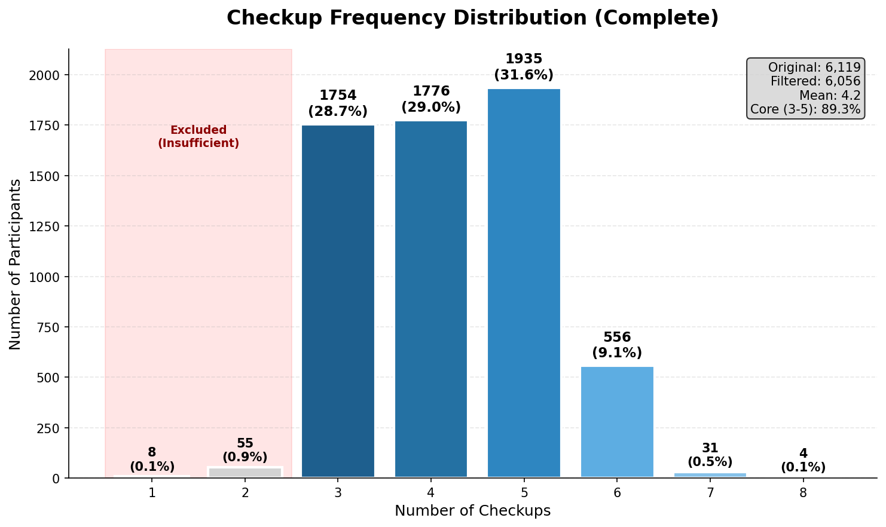

# 三高疾病預測建模成果報告

**研究主題**: 基於縱向健檢資料的三高疾病預測模型比較
**研究期間**: 2024年 - 2026年
**報告人**: 紀伯喬
**日期**: Meeting 17

---

## 封面講稿 (1分鐘)

各位好，今天要向大家報告「基於縱向健檢資料的三高疾病預測模型比較」。

首先要特別說明標題中的「縱向」兩個字。過去我們看了許多疾病預測的論文，大部分都是橫斷面研究，也就是只用單一時間點的資料來預測疾病風險。但這種方法有個重要的限制：它無法捕捉個體健康狀態的動態變化。

什麼是縱向資料呢？就是對同一個人持續追蹤多年，記錄他每次健檢的結果。舉例來說，我們可以看到某個人第一年血糖90，第二年92，第三年95，這種逐年上升的趨勢，就是橫斷面研究無法捕捉的重要資訊。

所以在命名論文時，我們使用「縱向」這個詞，就是要清楚識別這個特點：我們追蹤的不是一群不同的人，而是同一群人在不同時間點的健康變化。這種設計讓我們能夠計算變化量特徵，也就是Delta特徵，這正是本研究的核心創新。

接下來我會詳細介紹資料集的特性、面臨的挑戰，以及六種模型的比較結果。

---

## Slide 1: 資料集品質與檢查次數分佈

### 📊 資料來源
- **原始資料**: 6,119 位受檢者
- **篩選後**: 6,056 位 (移除 63 筆不完整記錄)
- **平均檢查次數**: 4.2 次

### 📈 檢查次數分佈



| 檢查次數 | 1次 | 2次 | 3次 | 4次 | 5次 | 6次 | 7次 | 8次 |
|---------|-----|-----|------|------|------|-----|-----|-----|
| 人數 | 8 | 55 | 1,754 | 1,776 | 1,935 | 556 | 31 | 4 |
| 百分比 | 0.1% | 0.9% | 28.7% | 29.0% | 31.6% | 9.1% | 0.5% | 0.1% |

- **已排除**: 1-2次 (63人，資料不足)
- **核心樣本**: 3-5次 (5,465人，89.3%)

### 📢 講稿 (1分鐘)

各位好,今天要向大家報告三高疾病預測的建模成果。首先看資料集的品質,我們從6,119位受檢者中篩選出6,056位樣本。

我們對資料做了兩個主要的過濾。第一,我們捨棄了檢驗次數低於3次的紀錄,只保留至少有3次檢驗的受檢者,因為我們的研究設計是把T1到T2當作訓練集,T2到T3當作測試集,至少需要三個時間點。

第二個過濾更重要,我們針對慢性疾病早期症狀不明顯的特性做設計。如果一個人有多次檢驗結果,我們只取前三次,因為前期的檢驗結果較可能是正常的,這樣才能真正測試模型對早期風險的預測能力。這是一個縱向資料集,將近90%的人有3到5次檢查記錄,平均4.2次,讓我們能夠追蹤健康狀態的動態變化。

---

## Slide 2: 問題描述

### 🎯 研究問題（數學表述）

**給定**: 個體在 T₁, T₂ 的健檢資料
**預測**: T₃ 是否罹患三高疾病

```
f(X_T₁, X_T₂, Δ) → Y_T₃ ∈ {0, 1}

其中:
• X_T₁, X_T₂: T₁, T₂ 時間點的生物標記
• Δ = X_T₂ - X_T₁: 縱向變化量（核心創新）
• Y_T₃: T₃ 的疾病狀態（高血壓/高血糖/高血脂）
```

### 📊 預測目標（三個二元分類問題）
- **高血壓** (16.68%, 1,010人)
- **高血糖** (5.53%, 335人)
- **高血脂** (5.96%, 361人)

### 🔑 核心挑戰
1. **類別極度不平衡** (< 6%)
2. **如何有效利用 Δ 特徵?**
3. **模型選擇** (可解釋 vs 性能)

### 📢 講稿 (40秒)

我們的研究問題用數學式表達就是:給定個體在T1和T2兩個時間點的健檢資料,預測T3時是否會罹患三高疾病。這裡的關鍵是Δ,也就是Delta,代表T2減T1的變化量,這是我們的核心創新。

預測目標是三個二元分類問題:高血壓、高血糖、高血脂。面臨三大挑戰:第一是類別極度不平衡,高血糖和高血脂只有6%左右;第二是如何有效利用Delta特徵;第三是如何在可解釋性與預測性能間取得平衡。

---

## Slide 3: 實驗設計與模型總覽

### 🎯 評估指標
- **AUC** (主要指標): 模型區分能力
- **F1 Score**: 精確率與召回率的調和平均
- **Recall**: 疾病篩檢的敏感度（重要！）

### 🔬 測試模型 (6 種)

| 編號 | 模型 | 類型 | 主要特色 |
|------|------|------|----------|
| 01 | Logistic Regression | 傳統統計 | 可解釋性最高 |
| 02 | Random Forest | 集成學習 | 原生多輸出支援、快速訓練 |
| 03 | XGBoost | 集成學習 | 產業標準、特徵重要性 |
| 04 | Neural Networks | 深度學習 | 非線性建模 |
| 05 | SVM | 核方法 | 最大間隔分類器 |
| 06 | Genetic Programming | 演化計算 | 符號回歸、公式發現 |

### 🛠️ 類別不平衡處理
- **LR/RF/XGBoost/SVM**: `class_weight='balanced'`
- **ANN**: Custom class weight dictionary
- **GP**: ❌ gplearn 不支援 (致命缺陷)

### 📢 講稿 (1分鐘)

為了全面評估不同模型的表現,我們總共測試了6種模型,涵蓋了從傳統統計到前沿演化計算的各種方法。包括最經典的Logistic Regression、Random Forest和XGBoost這些集成學習方法、深度學習的Neural Networks、支援向量機SVM,以及較新的Genetic Programming。我們選擇AUC作為主要評估指標,因為它能有效衡量模型的區分能力,不受類別不平衡影響。同時也關注F1分數和Recall,特別是Recall在疾病篩檢中非常重要,因為我們希望能捕捉到盡可能多的潛在患者。針對類別不平衡問題,我們在大部分模型中使用了class_weight='balanced'機制,讓模型更重視少數類別的樣本。但要特別注意的是,Genetic Programming因為套件限制無法使用這個機制,這也成為它後來失敗的主要原因。

---

## Slide 4: 模型效能總覽 (AUC 比較)

### 🏆 六種模型 × 三種疾病 AUC 比較

| 疾病 \ 模型 | LR | RF | XGBoost | ANN | SVM | GP |
|------------|----|----|---------|-----|-----|----|
| **高血壓** | 0.749 | 0.796 | 0.795 | **0.803** 🥇 | 0.793 | 0.714 |
| **高血糖** | **0.931** 🥇 | 0.892 | 0.903 | 0.899 | 0.904 | - |
| **高血脂** | **0.888** 🥇 | 0.868 | 0.886 | 0.861 | 0.858 | 0.500 |
| **平均訓練時間** | ~1秒 | 秒級 | 秒級 | ~7秒 | ~11秒 | 3.8分鐘 |

**特別標註**: RF 多任務學習（MTL）在高血糖達到 **0.914** 🥈

### 📊 關鍵發現
1. **沒有單一最佳模型** - 不同疾病最佳模型不同
2. **LR 表現驚豔** - 在高血糖/高血脂達到最佳 AUC
3. **ANN 高血壓最佳** - AUC 0.803 (超越所有模型)
4. **RF 穩定優秀** - 三個疾病都在前四名 (第2-3名)
5. **MTL RF 突破** - 高血糖 AUC=0.914 達到第2名！
6. **XGBoost 最穩定** - 三個疾病都在前三名
7. **GP 全面失敗** - 高血脂 AUC=0.5 (隨機猜測)

### ⚡ 訓練速度比較
- **LR**: ~1秒（最快）
- **RF/XGBoost**: 秒級
- **ANN**: ~7秒/模型（MTL 版本 9.3秒可同時預測三種疾病）
- **SVM**: ~11秒
- **GP**: 3.8分鐘（最慢且無效）

### 📢 講稿 (1分鐘)

現在來看整體的模型效能比較。這張表格展示了各模型在三種疾病上的AUC排名,我們可以看到一個非常重要的發現:沒有單一最佳模型。不同疾病的最佳模型完全不同。在高血壓預測上,ANN以0.803的AUC拿下冠軍,Random Forest和XGBoost緊追在後。但在高血糖和高血脂的預測上,最簡單的Logistic Regression反而表現最好,AUC分別達到0.931和0.888,這真的讓我們相當驚訝。XGBoost展現了最穩定的表現,在三種疾病上都進入前三名。Random Forest也相當穩定,特別值得一提的是它的多任務學習版本在高血糖預測上達到第二名,AUC 0.914。最讓人失望的是Genetic Programming,在高血脂上的AUC只有0.5,等於隨機猜測。從訓練速度來看,所有成功的模型都在秒級完成,LR最快只需1秒,ANN平均每個疾病7秒,SVM約11秒,都非常有效率。只有GP需要3.8分鐘但完全無效。

---

## Slide 5: 五大模型全面比較

### 📊 綜合效能比較表

| 模型 | 高血壓 AUC | 高血糖 AUC | 高血脂 AUC | 訓練速度 | 核心優勢 | 主要劣勢 |
|------|-----------|-----------|-----------|----------|----------|----------|
| **LR** | 0.749 (5th) | **0.931 (1st)** | **0.888 (1st)** | **~1秒** | 最高Recall(0.73-0.83)、完美可解釋性 | 高血壓表現一般 |
| **RF** | 0.796 (2nd) | 0.892 (5th) | 0.868 (3rd) | **秒級** | 原生多輸出、MTL優異(高血糖0.914) | F1/Recall偏低 |
| **XGBoost** | 0.795 (3rd) | 0.903 (4th) | 0.886 (2nd) | **秒級** | 最高F1、最穩定(全進前三) | 無突出劣勢 |
| **ANN** | **0.803 (1st)** | 0.899 (4th) | 0.861 (4th) | 分鐘級 | 高血壓冠軍、高Recall(81.2%) | 訓練慢、不可解釋 |
| **SVM** | 0.793 (4th) | 0.904 (3rd) | 0.858 (5th) | 11秒 | 訓練速度驚喜(比預期快300倍) | 無明顯優勢 |

### 🎯 模型特性深度分析

#### **Logistic Regression** - 醫學應用首選 🥇
- **驚豔表現**: 🥇 高血糖/高血脂雙冠軍 (AUC: 0.931, 0.888)
- **最高Recall**: 全部疾病 Recall 最高 (0.728-0.833),捕捉最多患者
- **極致效率**: 訓練僅需 ~1 秒
- **完美可解釋**: 提供係數、Odds Ratio,符合醫學邏輯
- **特徵重要性**: 高血壓看SBP/DBP、高血糖看FBG、高血脂看TC
- **適用場景**: 臨床解釋、快速部署、疾病篩檢

#### **Random Forest** - 多任務學習之星
- **穩定排名**: 高血壓第2、高血脂第3名
- **MTL突破**: 多任務版本高血糖AUC=0.914(第2名),提升0.022
- **原生多輸出**: 單一模型同時預測三種疾病
- **特徵重要性**: 提供feature_importances_,可視覺化
- **缺點**: F1和Recall偏低,需調整threshold
- **適用場景**: 多疾病聯合預測、快速原型

#### **XGBoost** - 最穩定通用模型
- **最穩定**: 三個疾病全進前三名 (2nd, 4th, 2nd)
- **最高F1**: 所有疾病F1分數第一 (0.449-0.537)
- **平衡效能**: Precision與Recall最佳平衡
- **訓練快速**: 秒級完成,提供特徵重要性
- **適用場景**: 實務部署首選、特徵工程、模型分析

#### **Neural Networks** - 高血壓專家 🥇
- **🥇 高血壓冠軍**: AUC=0.803,超越所有模型
- **高Recall**: 高血壓Recall=0.812,捕捉81.2%患者
- **架構**: Input(26) → Dense(64,ReLU) → Dropout(0.3) → Dense(32,ReLU) → Dropout(0.3) → Output(1,Sigmoid)
- **MTL挑戰**: 初步MTL失敗(高血脂F1=0),需調整loss_weights=[1.0, 3.0, 3.0]
- **缺點**: 訓練時間長、可解釋性差
- **適用場景**: 追求極致效能、研究用途

#### **SVM** - 速度驚喜但無優勢
- **速度驚喜**: 總訓練11秒,比預期快300倍(原估1-2小時)
- **中階表現**: 高血糖第3名(0.904)、高血壓第4名(0.793)
- **高Recall**: 高血壓Recall=0.738
- **原因分析**: 資料標準化良好、sklearn優化、樣本數適中
- **結論**: 穩定但無突出優勢,不如XGBoost/LR
- **適用場景**: 不推薦優先使用

### 🔑 關鍵發現總結
1. **疾病特異性**: 不同疾病需要不同模型(LR擅長高血糖/高血脂,ANN擅長高血壓)
2. **簡單有效**: LR以最簡單架構達到兩項冠軍,證明複雜≠更好
3. **穩定性價值**: XGBoost和RF展現優秀的跨疾病穩定性
4. **MTL潛力**: RF的多任務學習版本顯著提升高血糖預測
5. **速度效率**: 除ANN外,所有5個成功模型都能秒級訓練,實務可行性高

### 📢 講稿 (1分鐘)

現在來看五大成功模型的全面比較。這張表格整合了所有表現良好的模型在三種疾病上的效能。首先是Logistic Regression,它是本研究最大的驚喜,在高血糖和高血脂上都是冠軍,而且所有疾病的Recall都是最高的,加上只需要1秒訓練和完美的可解釋性,非常適合臨床應用。Random Forest展現了穩定的排名,更令人興奮的是它的多任務學習版本在高血糖上達到第二名,證明單一模型可以有效同時預測三種疾病。XGBoost是最穩定的通用模型,三個疾病全部進入前三名,F1分數最高,是實務部署的首選。ANN在高血壓上表現最好,AUC 0.803,但訓練時間較長且不可解釋。SVM雖然訓練速度比預期快300倍,但整體表現沒有突出優勢。這五個模型展現了各自的優勢和適用場景,為實務應用提供了豐富的選擇。

---

## Slide 6: Genetic Programming 建模方式與失敗分析

### 🧬 GP 簡介與建模方式

**使用套件**: `gplearn` - Python 的 Genetic Programming 套件

**核心概念**: 符號回歸 (Symbolic Regression)
- 不預設模型形式，讓演化算法自動發現最佳數學公式
- 從資料中「演化」出預測公式，而非「擬合」參數

### ⚙️ 關鍵參數設定

| 參數 | 設定值 | 功能說明 |
|------|--------|----------|
| `population_size` | 1000 | 每個世代的公式數量 |
| `generations` | 20 | 演化世代數 |
| `tournament_size` | 20 | 錦標賽選擇：隨機挑 20 個，選最佳當父母 |
| `function_set` | +, -, ×, ÷, log, √ | 允許的數學運算子 |
| `parsimony_coefficient` | 0.01 | **複雜度懲罰**：越大越偏好簡單公式 |
| `metric` | log loss | 適應度函數：評估公式好壞 |

### 🔄 GP 演化流程

```
1. 初始化 → 隨機生成 1000 個公式（樹狀結構）
2. 評估   → 用 log loss 計算每個公式的適應度
3. 選擇   → 錦標賽選擇：隨機挑 20 個，最佳者繁殖
4. 繁殖   → 交配 (70%) + 突變 (25%) + 複製 (5%)
5. 重複   → 執行 20 個世代
6. 輸出   → 返回最佳公式
```

### 📊 演化結果：公式分析

| 疾病 | 演化公式 | AUC | 問題 |
|------|----------|-----|------|
| 高血壓 | `add(log(-0.14), X8)` | 0.714 | 只用 DBP_T2，log(負數) |
| 高血糖 | `log(mul(X10, -0.14))` | 0.838 | 只用 TC_T2 |
| 高血脂 | `log(-0.058)` | **0.500** | ⚠️ **常數！完全沒用特徵** |

### ❌ 失敗根本原因

#### 1️⃣ **gplearn 不支援 class_weight**
- 其他模型都能用 `class_weight='balanced'` 處理不平衡
- GP 無此機制，導致模型偏向預測多數類（健康）

#### 2️⃣ **parsimony_coefficient 過大**
```
實際適應度 = 預測適應度 + 0.01 × 公式長度
```
- 在類別不平衡下，「預測常數」既簡單又能降低 loss
- 高血脂直接退化成常數公式 `log(-0.058)`

#### 3️⃣ **log loss 在不平衡數據的問題**
- 高血脂只有 5.96% 正樣本
- 預測全部為 0 的 log loss ≈ 0.22（看起來「還不錯」）
- GP 找到了「作弊」策略：預測常數

### 📚 學術價值：有價值的負面結果

1. **證明 class_weight 的重要性** - 與其他 5 個成功模型對比
2. **揭示 GP 的適用限制** - 不適合高維度、高度不平衡的醫學資料
3. **避免 publication bias** - 誠實報告失敗，增強研究完整性

### 📢 講稿 (1分鐘)

接下來介紹Genetic Programming的建模方式和失敗分析。我們使用gplearn套件進行符號回歸,這是一種讓演化算法自動發現數學公式的方法。關鍵參數包括族群大小1000、演化20個世代,以及parsimony coefficient設為0.01來控制公式複雜度。演化流程是:先隨機生成1000個公式,用log loss評估適應度,透過錦標賽選擇優秀個體,再經過交配和突變產生下一代。然而結果令人失望,高血脂的公式竟然退化成常數log負0.058,AUC只有0.5等於隨機猜測。失敗原因有三:第一,gplearn不支援class_weight機制;第二,parsimony coefficient設定讓GP過度追求簡單公式;第三,log loss在不平衡數據下會讓模型傾向預測多數類。雖然GP失敗了,但這是有價值的負面結果,證明了class_weight機制的重要性,也為模型選擇提供了重要參考。

---

## Slide 7: Multi-Task Learning 嘗試與反思

### 🎯 什麼是 MTL？為何嘗試？

**定義**: 單一模型同時預測多個任務（高血壓、高血糖、高血脂）

**當初動機**: 預期能減少計算時間、共享疾病間的關聯特徵

### 💭 預期 vs 實際

| 面向 | 原本預期 | 實際情況 |
|------|----------|----------|
| **計算效率** | 減少訓練時間 | 資料量小 (6,056)，所有模型**秒級完成** |
| **效能提升** | 共享表徵學習 | 僅高血糖 +0.022，**其他無提升** |

### 📊 實驗結果

| 模型 | 結果 | 說明 |
|------|------|------|
| **RF MTL** | 高血糖 AUC 0.892→0.914 (+0.022) | ✅ 唯一成功案例 |
| **ANN MTL** | 高血脂 F1=0，完全失敗 | ❌ 類別不平衡導致少數類被忽略 |

### ⚠️ 結論：未來將捨棄 MTL

**原因**：
1. **效率優勢不存在** - 資料量小，Single-Task 也是秒級
2. **效能提升有限** - 僅高血糖微幅提升
3. **Single-Task 已足夠好** - LR 在高血糖/高血脂已是冠軍

**決定**: 回歸 Single-Task，各疾病選用最佳模型

### 📢 講稿 (40秒)

接下來談談Multi-Task Learning的嘗試。當初選擇MTL是預期能減少計算時間,但實際資料量只有6056筆,所有模型都是秒級完成,效率優勢不存在。實驗結果方面,Random Forest的MTL版本在高血糖上提升了0.022,但ANN的MTL版本完全失敗。綜合評估後,我們決定未來將捨棄MTL,回歸Single-Task模型,因為Logistic Regression單任務在高血糖和高血脂已經是冠軍,沒有必要增加複雜度。

---

## Slide 8: 實務建議與模型選擇指南

### 🎯 分疾病推薦方案

| 疾病 | 首選模型 | AUC | 理由 | 備選模型 |
|------|----------|-----|------|----------|
| **高血壓** | ANN | 0.803 | 最高準確率 + 高 Recall | RF 0.796 (第2名) |
| **高血糖** | LR | 0.931 | 最佳 AUC + 極快速度 | MTL RF 0.914 (第2名) |
| **高血脂** | LR | 0.888 | 最佳 AUC + 最高 Recall | XGBoost 0.886 (次高) |

---

### 🏆 通用模型推薦

#### 1️⃣ **XGBoost** - 首選通用方案
- ✅ 三個疾病都在前三名
- ✅ 最高 F1 分數 (平衡 Precision/Recall)
- ✅ 提供特徵重要性分析
- ✅ 訓練速度快 (~秒級)
- 📌 **適合**: 實務部署、特徵工程、模型分析

#### 2️⃣ **Logistic Regression** - 最高 CP 值
- ✅ 兩個疾病第一名 (高血糖/高血脂)
- ✅ 所有疾病最高 Recall (醫學應用關鍵)
- ✅ 極快速度 + 完美可解釋性
- 📌 **適合**: 臨床解釋、快速原型、基線模型

#### 3️⃣ **Random Forest** - 多任務學習首選
- ✅ 原生多輸出支援 (單模型預測三種疾病)
- ✅ MTL RF 在高血糖達到第2名 (AUC=0.914)
- ✅ 高血壓第2名、高血脂第3名
- ✅ 訓練速度快 (~秒級)
- ✅ 良好可解釋性 (特徵重要性)
- 📌 **適合**: 多疾病聯合預測、快速原型、需要同時處理三高

#### 4️⃣ **ANN** - 追求極致效能
- ✅ 高血壓最佳模型 (AUC=0.803)
- ⚠️ 訓練時間較長
- ⚠️ 可解釋性差
- 📌 **適合**: 研究用途、追求最高準確率

---

### ❌ 不推薦模型

- **SVM**: 無明顯優勢,可解釋性差
- **GP**: 嚴重失敗,不適合不平衡醫學資料

---

### 🔧 實務部署建議

**如果只能選一個模型**:
```
XGBoost (平衡效能、速度、可解釋性)
```

**如果需要最高 Recall** (疾病篩檢):
```
Logistic Regression (Recall: 0.73-0.83)
```

**如果需要極致 AUC**:
```
高血壓: ANN (0.803)
高血糖: LR (0.931)
高血脂: LR (0.888)
```

**如果需要多疾病聯合預測**:
```
Random Forest (原生多輸出、MTL 效能優異)
```

### 📢 講稿 (1分鐘)

基於前面的實驗結果,我們整理出清楚的實務建議和模型選擇指南。如果要針對特定疾病選擇模型,高血壓建議使用ANN,因為它有最高的AUC 0.803和Recall。高血糖和高血脂都建議使用Logistic Regression,不僅AUC最高,訓練速度也極快。如果需要一個通用模型來處理所有疾病,我們首推XGBoost,它在三個疾病上都進入前三名,F1分數最高,訓練快速,還能提供特徵重要性分析,非常適合實務部署。Logistic Regression是CP值最高的選擇,兩個疾病第一名,所有疾病都有最高Recall,加上極快的速度和完美的可解釋性,很適合臨床應用。Random Forest則是多任務學習的首選,它原生支援多輸出,MTL版本在高血糖達到第二名,可以用單一模型同時預測三種疾病。ANN適合追求極致效能的研究用途。至於SVM和GP我們不推薦使用,前者沒有明顯優勢,後者則嚴重失敗。

---

## Slide 9: 未來研究方向與總結

### 🚀 六大研究方向

#### 1️⃣ Multi-Task Learning 深化與優化

**已完成**:
- ✅ Random Forest MTL 在高血糖達到第2名 (AUC=0.914)
- ✅ 發現 ANN MTL 的類別不平衡主導問題

**待探索**:
- 🔬 優化 MTL ANN 的 loss_weights 參數
  - 測試不同權重組合: [1, 2, 2], [1, 3, 3], [1, 5, 5]
  - 尋找最佳平衡點
- 🔬 探索 task-specific 與 shared layers 的最佳比例
  - Hard parameter sharing vs Soft parameter sharing
  - 部分共享架構: Shared(26→32) → [Task1(32→16→1), Task2(...), Task3(...)]
- 🔬 比較不同 MTL 架構的優劣
  - RF MTL vs ANN MTL vs XGBoost MTL
  - 集成學習是否天生更適合 MTL?

**預期貢獻**: 突破 ANN MTL 失敗困境,實現三種模型的多任務版本

---

#### 2️⃣ 集成學習 (Ensemble Learning) 探索

**Stacking 方案**:
```
Level 0 (Base Models):
  - LR (高血糖/高血脂專家, AUC: 0.931, 0.888)
  - ANN (高血壓專家, AUC: 0.803)
  - RF (通用穩定, MTL 能力強)
  - XGBoost (最穩定, 全進前三)

Level 1 (Meta-Model):
  - Logistic Regression (簡單、可解釋)
  - 學習如何組合各模型的預測
```

**Voting 方案**:
- Soft Voting: 結合 RF (0.796) + XGBoost (0.795) + ANN (0.803) 的機率
- 預期高血壓 AUC 可能突破 0.810

**Weighted Ensemble**:
- 根據各疾病最佳模型動態調整權重
- 高血壓: ANN × 0.6 + RF × 0.2 + XGBoost × 0.2
- 高血糖: LR × 0.6 + MTL RF × 0.4
- 高血脂: LR × 0.5 + XGBoost × 0.5

**預期貢獻**: 結合各模型優勢,突破單一模型效能上限

---

#### 3️⃣ 深度特徵工程

**已有特徵**:
- T1 生物標記 (8)
- T2 生物標記 (8)
- Δ 線性變化 (T2 - T1) (8)

**新特徵方向**:

**A. 非線性變化率**:
- 比值特徵: T2/T1 (捕捉相對變化)
- 百分比變化: (T2-T1)/T1 × 100%
- 對數變化: log(T2/T1)
- 範例: `FBG_ratio = T2_FBG / T1_FBG` (若 >1.2 則血糖惡化)

**B. 特徵交互項**:
- SBP × BMI (血壓與體重交互作用)
- FBG × BMI (血糖與肥胖關聯)
- TC × Age (血脂隨年齡變化)
- Polynomial features (2次交互項)

**C. 領域知識特徵**:
- 代謝症候群指標: (FBG>100) + (SBP>130) + (BMI>24)
- 惡化速度: Δ_SBP / (T2_date - T1_date)
- 風險分層: 根據 AHA/ACC 指南

**D. 降維與特徵選擇**:
- PCA: 減少 26 維到 15 維
- Feature importance 篩選: 只保留 Top 15 特徵
- LASSO: 自動特徵選擇

**預期貢獻**: 非線性特徵可能提升 2-5% AUC

---

#### 4️⃣ 時間序列深度學習

**動機**:
- 現有模型只用 T1, T2 兩個時間點的靜態特徵
- 未充分利用時間序列的動態變化模式
- LSTM/GRU 可捕捉長期依賴關係

**LSTM 架構**:
```
輸入: [T1特徵(8), T2特徵(8)] → 序列長度=2, 特徵數=8
      ↓
LSTM(64 units, return_sequences=False)
      ↓
Dropout(0.3)
      ↓
Dense(32, ReLU)
      ↓
Output(1, Sigmoid)
```

**Transformer 架構**:
- Multi-head Self-Attention 捕捉特徵間關聯
- Positional Encoding 編碼時間資訊
- 更強的表達能力

**Bi-LSTM**:
- 雙向處理 T1→T2 和 T2→T1
- 捕捉雙向時間依賴

**預期挑戰**:
- 只有 2 個時間點,序列太短
- 可能需要更多時間點資料 (T0, T1, T2, T3)

**預期貢獻**: 若有更多時間點,LSTM 可能大幅超越靜態模型

---

#### 5️⃣ 可解釋性 AI (Explainable AI)

**動機**:
- ANN/XGBoost 表現優秀但難以解釋
- 醫療應用需要透明的決策過程
- 醫生需要理解"為什麼模型認為病人有風險"

**SHAP (SHapley Additive exPlanations)**:
```python
import shap

# XGBoost 解釋
explainer = shap.TreeExplainer(xgb_model)
shap_values = explainer.shap_values(X_test)

# 視覺化
shap.summary_plot(shap_values, X_test)  # 特徵重要性
shap.force_plot(...)  # 個別預測解釋
shap.waterfall_plot(...)  # 單一樣本分析
```

**LIME (Local Interpretable Model-agnostic Explanations)**:
- 局部線性近似黑盒模型
- 解釋單一預測結果

**應用場景**:
1. **全局解釋**: 哪些特徵最重要?
   - 高血壓: SBP, DBP, Δ_SBP 最關鍵
   - 高血糖: FBG, Δ_FBG 主導
   - 高血脂: TC, Δ_TC 重要

2. **個別解釋**: 為什麼這個病人被預測為高風險?
   - 範例: "SBP從120升到145 (+25) 貢獻 +0.3 機率"

3. **特徵交互**: 哪些特徵組合效果強?
   - 範例: "SBP高 + BMI高 → 高血壓風險×2"

4. **規則抽取**: 從模型提取決策規則
   - IF (Δ_FBG > 15) AND (T2_FBG > 110) THEN 高風險

**預期貢獻**: 提升模型可信度,促進臨床應用

---

#### 6️⃣ 外部驗證與泛化能力測試

**動機**:
- 當前模型只在單一資料集訓練/測試
- 不確定是否能推廣到其他族群
- 需要驗證模型的實際應用價值

**驗證方向**:

**A. 跨地區驗證**:
- 台北 vs 高雄健檢資料
- 城市 vs 鄉村族群
- 驗證地理差異影響

**B. 跨族群驗證**:
- 不同年齡層: 30-40歲 vs 50-60歲
- 不同性別: 男性 vs 女性
- 驗證人口統計差異

**C. 跨機構驗證**:
- 醫院 A 訓練 → 醫院 B 測試
- 評估模型在不同機構的穩定性

**D. 時間驗證**:
- 2020年資料訓練 → 2023年資料測試
- 驗證時間推移的影響

**Domain Adaptation**:
- 若外部驗證失敗,使用遷移學習
- Fine-tuning: 在目標資料集上微調

**預期貢獻**: 證明模型泛化能力,推動實際部署

---

### 🎯 優先級排序

| 優先級 | 方向 | 理由 | 預期時間 |
|--------|------|------|----------|
| **P0** | MTL 深化 | 已有基礎(RF MTL成功),ANN MTL待修復 | 1-2週 |
| **P1** | 集成學習 | 低成本高回報,可快速提升效能 | 1週 |
| **P1** | 可解釋性 AI | 醫療應用必需,學術價值高 | 1-2週 |
| **P2** | 深度特徵工程 | 需要領域知識,效果不確定 | 2-3週 |
| **P2** | 外部驗證 | 需要額外資料集,可能難取得 | 時間不定 |
| **P3** | 時間序列模型 | 需要更多時間點資料,當前資料不足 | 未來考慮 |

---

### 📢 講稿 (1分鐘)

最後總結本研究的貢獻與未來方向。我們規劃了六個研究方向:首先是深化Multi-Task Learning,RF MTL已在高血糖上證明有效,接下來要優化ANN MTL的loss_weights參數。第二是集成學習,透過Stacking或Voting結合各模型優勢。第三是深度特徵工程,加入比值、交互項等特徵。第四是時間序列深度學習,用LSTM處理時間動態。第五是可解釋性AI,使用SHAP來解釋模型預測。第六是外部驗證,在其他資料集上測試泛化能力。本研究的主要貢獻包括:6種模型的全面比較、證明Delta特徵工程的有效性、揭示類別不平衡處理的重要性,以及提供清晰的實務建議。所有實驗都有完整的Jupyter Notebook記錄,確保研究的可重現性。感謝各位的聆聽,謝謝！

---

### 🙏 致謝

感謝指導教授的專業指導與建議！

---

**簡報結束 - 謝謝聆聽！**